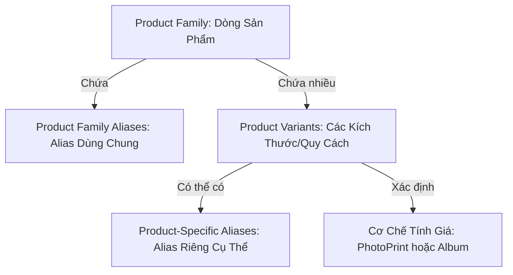

# Kiến Trúc Hệ Thống Lalab Auto Report V2

> Tài liệu kỹ thuật chi tiết về kiến trúc, mô hình dữ liệu, cơ chế phân tích và quy tắc nghiệp vụ phiên bản V2.
>
> Phiên bản: **2.0.0** (Nâng cấp từ V1)
>
> Nền tảng: **.NET 8.0 WPF (Windows Desktop, Local-First, SQLite)**

---

## 1. Tổng Quan Kiến Trúc (Architectural Overview)

Lalab Auto Report được thiết kế theo mô hình **Onion / Clean Architecture** với các ranh giới phân tách độc lập:

```text
+-------------------------------------------------------+
|                 LalabAutoReport.UI                    |
|      (WPF, MVVM, CommunityToolkit, Tinix Design)      |
+-------------------------------------------------------+
                           |
+-------------------------------------------------------+
|            LalabAutoReport.Infrastructure             |
|   (SQLite, Dapper, FileSystemAdapter, Migrations)     |
+-------------------------------------------------------+
                           |
+-------------------------------------------------------+
|                 LalabAutoReport.Core                  |
|  (Domain Models, Interfaces, SizeNormalizer, Resolvers|
|           BillingService, ReportService)              |
+-------------------------------------------------------+
```

### Ranh giới trách nhiệm (Separation of Concerns)
1. **Core:**
   - Hoàn toàn độc lập với UI và cơ chế truy xuất file vật lý.
   - Chứa Domain Entities, Enums, DTOs, Service Interfaces.
   - Đảm nhiệm nghiệp vụ lõi: Chuẩn hoá kích thước (`SizeNormalizer`), Nhận diện sản phẩm (`ProductResolver`), Tính giá (`BillingService`), Báo cáo (`ReportService`).
2. **Infrastructure:**
   - Triển khai `IFileSystemAdapter`, `ISqliteConnectionFactory`, các Repositories (`SqliteProductRepository`, `SqliteOrderRepository`, `SqliteBillRepository`, `SqliteCustomerRepository`).
   - Đảm bảo migration cơ sở dữ liệu (`DatabaseMigrator`) an toàn, bảo toàn 100% dữ liệu lịch sử V1.
3. **UI:**
   - Ứng dụng desktop WPF thuần túy, thiết kế theo hệ thống Tinix Design Tokens.
   - Giao tiếp với Core/Infrastructure hoàn toàn thông qua ViewModels và Interfaces bằng Dependency Injection (`Microsoft.Extensions.DependencyInjection`).

---

## 2. Mô Hình Sản Phẩm V2: Dòng Sản Phẩm -> Biến Thể -> Bảng Giá

Khắc phục triệt để hạn chế của V1 (phải gõ alias lặp lại cho từng size), V2 tổ chức sản phẩm theo 3 tầng:



### 2.1 Product Family (Dòng Sản Phẩm)
- Đại diện cho một nhóm sản phẩm có cùng đặc tính và phương thức thanh toán:
  - **Ảnh in** (`PhotoPrint` / `BillingMethod.FileCount`): Giá tính theo từng tấm (`UnitPrice`).
  - **Album** (`Album` / `BillingMethod.AlbumBasePlusExtra`): Giá gói theo số tờ chuẩn (`BasePrice` + `IncludedSheets`) và giá tờ phát sinh (`ExtraSheetPrice`).
- **Family Aliases (Alias Dùng Chung):**
  - Được chia sẻ tự động cho mọi kích thước thuộc dòng đó.
  - Ví dụ dòng Album có các alias: `ab`, `alb`, `album`.
  - Khi người dùng đặt tên thư mục `ab 20x30`, `alb 20x30`, `20x30 ab`, `album 20x30`, hệ thống tự động nhận diện dòng Album kích thước 20x30 mà **không cần tạo alias riêng cho từng size**.

### 2.2 Canonical Size Normalizer Engine (`SizeNormalizer`)
- Khử hoàn toàn độ nhạy chiều xoay ảnh: `20x30` và `30x20` được quy về một kích thước chuẩn duy nhất:
  $$\text{CanonicalSize} = \min(w, h) \times \max(w, h)$$
- Hỗ trợ đa dạng dấu phân cách và ký hiệu kích thước: `x`, `X`, `*`, `×`, `-`, `_`, `cm`, khoảng trắng.
- Tách phần kích thước và phần chữ còn lại (`remainingText`) để phục vụ nhận diện độc lập vị trí:
  - `ab 20x30` -> Size: `20x30`, Remainder: `ab` -> Family: `Album`
  - `20x30 in` -> Size: `20x30`, Remainder: `in` -> Family: `Ảnh in`
  - `30-20 alb` -> Size: `20x30`, Remainder: `alb` -> Family: `Album`
- Hỗ trợ khử hậu tố phân số/thứ tự sản phẩm (Job Index): `Album 20x20 - 1`, `Album 20x20 - 2`, `ab 20x20 (1)` được nhận diện chính xác về biến thể `Album 20x20` mà vẫn giữ 2 thư mục in độc lập.

### 2.3 Thứ Tự Ưu Tiên Phân Giải Sản Phẩm (`ProductResolver`)
Quy trình phân giải thực hiện nghiêm ngặt theo 4 mức ưu tiên:

```text
+------------------------------------------------------------------------+
| Priority 1: Exact Product-Specific Alias                                |
| Khớp alias riêng của biến thể (có kiểm tra xung đột trùng lặp).        |
+------------------------------------------------------------------------+
                               | (nếu không khớp)
                               v
+------------------------------------------------------------------------+
| Priority 2: Family Alias + Size (Position-Independent)                 |
| Tách Size -> CanonicalSize; phần chữ còn lại khớp với Family Aliases. |
+------------------------------------------------------------------------+
                               | (nếu không khớp)
                               v
+------------------------------------------------------------------------+
| Priority 3: Exact Canonical Product Name                               |
| Khớp chính xác tên chuẩn của sản phẩm trong bảng giá.                  |
+------------------------------------------------------------------------+
                               | (nếu không khớp)
                               v
+------------------------------------------------------------------------+
| Priority 4: Pure Size Ambiguity Check                                  |
| Thư mục chỉ có số size (vd: '20x30'):                                  |
| - Nếu chỉ 1 dòng sản phẩm có size này -> Tự động nhận diện.            |
| - Nếu từ 2 dòng sản phẩm có cùng size -> Chuyển NEEDS_REVIEW.          |
+------------------------------------------------------------------------+
```

---

## 3. Cấu Trúc Thư Mục và Phát Hiện Đơn Hàng (Folder Hierarchy)

Hệ thống hỗ trợ song song 3 trường hợp cấu trúc thư mục thực tế của xưởng in:

### Case A: Cấu trúc trực tiếp V1 (Direct Legacy)
```text
Date/
  Customer/
    Product Specification/
      (final print files)
```
- Tự động tạo một `Implicit Order` ("Đơn trực tiếp") bọc các sản phẩm.
- Tương thích 100% với toàn bộ dữ liệu lịch sử V1.

### Case B: Cấu trúc nhiều đơn tường minh V2 (Explicit Orders)
```text
Date/
  Customer/
    Don 01/
      13x18 in/
      Album 20x20/
    Don 02/
      20x30/
```
- Nhận diện `Don 01` và `Don 02` thành 2 `Explicit Order` độc lập trực thuộc cùng một khách hàng.
- Mỗi đơn có trạng thái, số lượng và tổng tiền riêng.

### Case C: Cấu trúc hỗn hợp (Mixed Hierarchy)
```text
Date/
  Customer/
    13x18 in/           <-- Sản phẩm trực tiếp -> gom vào Implicit Order
    Don Bo Sung/        <-- Thư mục đơn con -> tạo Explicit Order
      20x30/
```
- Phân tích ranh giới thông minh: Không bao giờ bỏ sót sản phẩm, không tạo đơn rác.

---

## 4. Cơ Chế Thư Mục Tính Số Lượng (Effective Billing Folder) & Thanh Toán

### 4.1 Khái niệm Thư mục tính số lượng (Effective Billing Folder)
- **Thay thế hoàn toàn khái niệm cũ `Final Print Folder`:**
  - Không còn ép buộc phải có thư mục in con (`retouch`, `in`, `final`).
  - **Effective Billing Folder** (hiển thị UI: *Thư mục tính số lượng*) là thư mục ảnh hợp lệ sâu nhất hiện đang tồn tại trong Product Job và được dùng làm **nguồn duy nhất** để xác định số lượng tính tiền (`BillQuantity`).
- **Hỗ trợ tính bill ngay khi nhận file (Intake / Trước in):**
  - Nếu file ảnh nằm trực tiếp tại thư mục sản phẩm và chưa có thư mục con nào chứa ảnh: `Effective Billing Folder = Thư mục sản phẩm`.
  - Giúp xưởng in có thể xuất bill tính tiền ngay cho khách hàng trước khi thợ kỹ thuật tiến hành chỉnh sửa hoặc in ấn.
- **Tiến trình thư mục động (Dynamic Folder Progression):**
  - Khi thợ chỉnh sửa tạo thêm thư mục con sâu hơn (vd: `13x18 in/sua/` hoặc `13x18 in/sua/sua lai/`), thao tác Quét Lại (Rescan) **tự động phân giải sang thư mục sâu hơn mới nhất**, không bao giờ bị dính (stick) vĩnh viễn vào thư mục cũ.
- **Cơ chế phân giải (`AutoResolved` vs `ManuallySelected`):**
  - `AutoResolved`: Khi chỉ có đúng 1 thư mục lá sâu nhất chứa ảnh (`leafFolders.Count == 1`), hệ thống tự động chọn và luôn cập nhật linh hoạt theo cây thư mục hiện tại trên đĩa.
  - `ManuallySelected`: Khi có nhiều thư mục lá tranh chấp (`leafFolders.Count > 1`), trạng thái chuyển sang `AmbiguousPrintFolder` (`NeedsReview`) để người dùng chọn nhánh thực tế. Lựa chọn thủ công chỉ được tái sử dụng khi quét lại **nếu thư mục đó vẫn tồn tại, còn chứa ảnh và vẫn là thư mục lá hợp lệ**. Nếu thư mục đã bị xóa hoặc thợ tạo nhánh con sâu hơn, hệ thống tự động đánh giá lại.

### 4.2 Lọc định dạng ảnh hỗ trợ
- Chỉ đếm các tệp có đuôi ảnh hợp lệ: `.jpg`, `.jpeg`, `.png`, `.tif`, `.tiff`, `.bmp`, `.webp`, `.heic` (so sánh không phân biệt hoa thường).
- Tự động bỏ qua các tệp tạm, hợp đồng, văn bản, thiết kế: `.txt`, `.psd`, `.doc`, `.zip`, `.exe`, v.v.
- Không giải mã pixel ảnh (Zero Image Decoding) nhằm đảm bảo tốc độ quét tối đa và tiết kiệm bộ nhớ RAM.

### 4.3 Công thức tính tiền cho từng dòng sản phẩm
1. **Ảnh in thông thường (`PhotoPrint` / `FileCount`):**
   $$\text{Thành tiền} = \text{Số ảnh in} \times \text{Đơn giá}$$
2. **Album (`Album` / `AlbumBasePlusExtra`):**
   - Số tờ album (`SheetCount`) chính là số file ảnh trong Thư mục tính số lượng (nghiêm cấm trừ bìa: **không trừ 2 tờ**).
   - Nếu $\text{SheetCount} > \text{IncludedSheets}$:
     $$\text{ExtraSheets} = \text{SheetCount} - \text{IncludedSheets}$$
     $$\text{Thành tiền} = \text{BasePrice} + (\text{ExtraSheets} \times \text{ExtraSheetPrice})$$
   - Nếu $\text{SheetCount} \le \text{IncludedSheets}$:
     $$\text{Thành tiền} = \text{BasePrice}$$
     *(Nếu số tờ ít hơn số tờ chuẩn, hệ thống ghi nhận cảnh báo nhắc nhở nhưng vẫn tính giá gói chuẩn).*
   - Nếu $\text{SheetCount} = 0$: Đánh dấu lỗi `Failed`, không cho phép tính tiền hoặc khóa đơn.
   - Nếu có 2 album cùng kích thước trong 1 đơn (vd: `Album 20x20 - 1` và `Album 20x20 - 2`): Hệ thống tạo 2 dòng bill riêng, mỗi cuốn được tính độc lập giá gói + tờ phát sinh riêng.

---

## 5. Tính Bất Biến Của Bill Đã Khóa và Xử Lý Draft Bill

### 5.1 Quản lý Draft Bill khi quét lại
- Với đơn hàng chưa khóa (`Draft` / `Ready` / `NeedsReview` / `Billed`):
  - Khi quét lại (Rescan), hệ thống tự động cập nhật lại `Effective Billing Folder`, cập nhật lại `bill_quantity`, và tự động tính lại `line_total` cùng `subtotal` của draft bill nếu đã tồn tại.
  - Draft bill được cập nhật trực tiếp theo ID hiện có, không tạo rác trùng lặp trong cơ sở dữ liệu.

### 5.2 Tính bất biến của Bill đã khóa (`Locked`)
- Khi đơn hàng được Khóa (`Locked`), hệ thống chụp lại toàn bộ thông tin lịch sử tại thời điểm khóa:
  - `product_name_snapshot`
  - `billing_method_snapshot`
  - `sheet_count`
  - `included_sheets_snapshot`
  - `extra_sheet_count`
  - `base_price_snapshot`
  - `extra_sheet_price_snapshot`
  - `final_print_folder_path` (đường dẫn snapshot của Thư mục tính số lượng)
  - `folder_resolution_mode_snapshot`
  - `unit_price`
  - `line_total`
- **Nguyên tắc bất biến:**
  - Thay đổi giá trong bảng giá **không bao giờ làm thay đổi tổng tiền** của các bill đã khóa.
  - Quét lại thư mục trên đĩa **tuyệt đối không ghi đè hay sửa đổi** dữ liệu bill đã khóa.
  - Nếu tệp hoặc thư mục trên đĩa thay đổi sau khi khóa (thay đổi số lượng tệp hoặc đổi thư mục tính số lượng), đơn hàng sẽ hiển thị cờ cảnh báo `filesystem_changed_after_lock = 1`.
  - Gọi hàm tính lại bill trên đơn đã khóa sẽ bị từ chối với ngoại lệ `InvalidOperationException`.
  - Muốn chỉnh sửa bill đã khóa, người dùng phải thực hiện quy trình mở khóa (`ReopenOrder`) tường minh.

---

## 6. Cơ Sở Dữ Liệu & Migration

Cơ sở dữ liệu SQLite cục bộ được quản lý bằng migration tuần tự:

| Phiên bản | Tên Migration | Nội dung chính |
|---|---|---|
| **V1** | InitialSchema | Bảng `customers`, `customer_aliases`, `print_specifications`, `orders`, `order_item_scans`, `bills`, `bill_lines`, `scan_snapshots` |
| **V2** | AddPostLockWarningField | Bổ sung cờ `filesystem_changed_after_lock` trên bảng `orders` |
| **V3** | V2ProductAndOrderHierarchy | Bổ sung `category`, `billing_method`, `included_sheets`, `base_price`, `extra_sheet_price` vào `print_specifications`; bổ sung `order_kind`, `order_name` vào `orders`; bổ sung snapshot columns vào `bill_lines` |
| **V4** | V2ProductFamilyAndVariants | Khởi tạo cấu trúc `product_families`, `product_family_aliases`, `product_variants`, `product_specific_aliases`; nạp sẵn dòng 'Ảnh in' và 'Album'; di chuyển an toàn dữ liệu từ bảng cũ sang cấu trúc mới có kiểm tra xung đột trùng lặp |
| **V5** | V2EffectiveBillingFolderAndResolutionMode | Bổ sung `folder_resolution_mode` vào bảng `order_item_scans` và `folder_resolution_mode_snapshot` vào bảng `bill_lines` với giá trị mặc định 'AutoResolved' |
| **V6** | CustomerBillingAndAdjustments | Bổ sung các bảng `customer_bills`, `customer_bill_orders`, `customer_bill_lines`, `customer_bill_adjustments` và liên kết `customer_bill_id` trên `order_item_scans` |
| **V7** | GuestBillingAndSourceFolders | Hỗ trợ bill khách lẻ: bổ sung `bill_type`, cho phép `customer_id` nhận giá trị `NULL` trên `customer_bills`, thêm cột `source_folder_path` trên `customer_bill_orders`, tạo bảng `guest_bill_source_folders` lưu vết đa thư mục nguồn |

---

## 7. Báo Cáo Không Truy Xuất Ổ Đĩa (Zero Disk Scan Reporting)

- Màn hình Báo Cáo Ngày (`DailyReport`), Báo Cáo Tháng (`MonthlyReport`) và Báo Cáo Khoảng Ngày (`DateRangeReport`) đọc **100% dữ liệu đã lưu trong SQLite**.
- Mở xem báo cáo tháng **tuyệt đối không kích hoạt quét ổ đĩa** hay duyệt lại cây thư mục.
- Tự động phát hiện các ngày làm việc bị thiếu quét (`MissingScanDays`) dựa trên so sánh giữa thư mục ngày trên ổ cứng và bảng `orders` trong SQLite.

---

## 8. Quy Trình Tính & Xuất Hóa Đơn Khách Hàng (Customer-Centric Billing & JPEG Export)

### 8.1 Luồng Nghiệp Vụ Chính
```text
[Chọn Khách Hàng Chuẩn (Canonical Customer)]
   ↓
[Bấm '⚡ Tính Bill Khách Hàng']
   ↓
[Gom tất cả Job/Order chưa thuộc Locked Bill từ mọi Alias folder]
   ↓
[Thực hiện Scoped Smart Rescan các Order cần thiết]
   ↓
[Tạo Draft Bill & Mở Cửa Sổ Review Hóa Đơn (CustomerBillReviewWindow)]
   ↓
[Chỉnh sửa / Điều chỉnh: Ghi đè số lượng, ghi đè đơn giá, bật/tắt mục, thêm Phụ phí/Ship/Giảm trừ]
   ↓
[Bấm 'Xuất Bill': Kiểm tra chặn lỗi -> Khóa Bill (Locked) -> Chụp Snapshot -> Render JPEG (1080px)]
   ↓
[Lịch sử Bill: Xem danh sách, mở bill, xuất lại JPEG từ snapshot (không quét lại đĩa)]
```

### 8.2 Nguyên Tắc Cốt Lõi
1. **Nguồn sự thật:** Tất cả đơn hàng / job in chưa thuộc Locked Bill trước đó (không giới hạn cứng theo khoảng ngày; đơn cũ ngoài kỳ được gắn cờ `Unbilled from previous period`).
2. **Bảo tồn nguồn gốc (Provenance):** Bill được lập theo Customer ID chuẩn, nhưng bên trong giữ trọn vẹn danh sách các đơn vật lý (`CustomerBillOrder`) kèm ngày và tên thư mục gốc, có subtotal riêng từng đơn.
3. **Ghi đè không phá hủy (Non-destructive Overrides):**
   - `ScannedQuantity` giữ nguyên giá trị đếm từ đĩa; người dùng nhập `BilledQuantity` kèm `QuantityOverrideReason`.
   - `ConfiguredUnitPrice` giữ nguyên giá tra từ bảng giá; người dùng nhập `BilledUnitPrice` kèm `PriceOverrideReason`.
4. **Khoản điều chỉnh (Adjustments):**
   - Số tiền cố định VND: Phí vận chuyển (Shipping, +), Phụ phí (Surcharge, +), Giảm giá / Chiết khấu (Discount, -), Khoản tùy chỉnh (Custom, +/-).
   - Công thức tổng tiền: $\text{GrandTotal} = \max(0, \text{ProductSubtotal} + \sum \text{Add} - \sum \text{Deduct})$.
5. **Xuất ảnh JPEG vector thuần túy:**
   - Sử dụng WPF `DrawingVisual` + `RenderTargetBitmap` + `JpegBitmapEncoder`.
   - Độ rộng cố định 1080px, chiều cao tính động theo nội dung (không bị tràn hay cắt chữ).
   - Định dạng tên file tất định: `BILL-yyyyMMdd-xxxx_{Tên-Khách-Bỏ-Dấu}.jpg` (khử sạch dấu tiếng Việt và ký tự đặc biệt).
   - **Tuyệt đối không phụ thuộc Excel / XLSX.**
6. **Bất biến & Xuất lại:**
   - Hóa đơn đã khóa (`Locked` / `Exported`) là bất biến.
   - Thao tác "Xuất lại JPEG" đọc trực tiếp dữ liệu từ snapshot trong SQLite, không quét lại ổ cứng, không lấy giá mới.
   - Hỗ trợ "Mở lại bill" (`ReopenBill`) hủy liên kết đơn hàng an toàn khi cần sửa đổi có lý do.

---

## 9. Tính Năng Quick Bill / Tính Bill Khách Lẻ (Guest Bill Workflow)

### 9.1 Mục Tiêu & Cơ Chế Hoạt Động
Tính năng **Quick Bill** phục vụ khách vãng lai, khách in gấp hoặc các trường hợp xưởng không muốn tạo hồ sơ khách hàng lâu dài trong cơ sở dữ liệu.

```text
[Chọn 1 hoặc nhiều Thư mục nguồn (Multi-Source Folders)]
   ↓
[Kiểm tra trùng lặp (Duplicate Detection qua PathNormalizer)]
   → [Nếu trùng bill cũ đã khóa: Hiện cảnh báo + nút 'Mở bill cũ' + tùy chọn tiếp tục/hủy]
   ↓
[Tự động lấy tên thư mục đầu làm Tên Khách Lẻ (Cho phép sửa trực tiếp)]
   ↓
[Quét các quy cách sản phẩm & tính đơn giá theo bảng giá]
   ↓
[Tạo Bill Draft với bill_type = GUEST, customer_id = NULL]
   ↓
[Mở cửa sổ Review Bill: Hiển thị badge ⚡ KHÁCH LẺ, nguồn thư mục từng đơn]
   ↓
[Khóa & Xuất JPEG chuẩn 1080px: BILL-yyyyMMdd-xxxx_{Ten-Khach-Bo-Dau}.jpg]
   ↓
[Tùy chọn: Bấm '👤 Chuyển thành Khách Hàng' để lưu hồ sơ chính thức khi cần]
```

### 9.2 Nguyên Tắc Kỹ Thuật Cốt Lõi
1. **Cô Lập Khách Hàng Tuyệt Đối (Customer Isolation):**
   - Hóa đơn khách lẻ có `bill_type = 'Guest'` và `customer_id = NULL`.
   - Các đơn vật lý tạm thời lưu trong `orders` có `customer_id = NULL`.
   - Bảng `customers` và `customer_aliases` sạch 100%, không bị chèn các bản ghi rác ("Khách lẻ", "Khách vãng lai").
   - Các truy vấn danh sách khách hàng, thống kê đơn chưa bill (`GetCustomerUnbilledSummaryAsync`), và lịch sử bill khách hàng hoàn toàn bỏ qua các bill khách lẻ.
2. **Hỗ Trợ Đa Thư Mục Nguồn (Multi-Source Folders):**
   - Cho phép gom nhiều thư mục rời rạc (ví dụ: `Chi Lan 1`, `Chi Lan them`, `Lan album`) vào chung một hóa đơn.
   - Bảng `guest_bill_source_folders` lưu vết từng thư mục nguồn (`folder_path`, `normalized_folder_path`).
   - Mỗi đơn con (`CustomerBillOrder`) lưu `SourceFolderPath` để biết chính xác dòng sản phẩm nào bắt nguồn từ thư mục nào.
3. **Chuẩn Hóa Đường Dẫn & Phát Hiện Trùng Lặp (Duplicate Detection):**
   - `PathNormalizer` chuẩn hóa đường dẫn Windows (phân giải full path, đồng nhất dấu `\`, cắt dấu gạch chéo cuối, chuyển chữ thường invariant).
   - `CheckDuplicateSourceFoldersAsync` kiểm tra xem thư mục đã từng được tính trong bill nào có trạng thái `Locked` hoặc `Exported` hay chưa.
   - Nếu có, hiển thị `DuplicateFolderWarning` với đầy đủ thông tin: Mã bill trước, ngày lập, tổng tiền, đường dẫn file JPEG, kèm nút **"Mở bill cũ"** để người dùng kiểm tra trước khi quyết định tính đè hoặc hủy bỏ.
4. **Chuyển Đổi Khách Lẻ Thành Khách Hàng (`ConvertGuestBillToCustomerAsync`):**
   - Người dùng có thể nâng cấp hóa đơn khách lẻ thành khách hàng chính thức chỉ bằng 1 thao tác.
   - Tìm kiếm hoặc tạo mới khách hàng chuẩn (`Customer`), gán `bill.CustomerId = customer.Id`, chuyển `bill.BillType = Customer`, cập nhật `customer_id` trên toàn bộ các đơn hàng vật lý liên quan trong SQLite.
   - Bảo toàn 100% tính toàn vẹn tài chính, số lượng và lịch sử hóa đơn.

---

## 10. Kiến Trúc Đồng Bộ Vận Hành Đám Mây V2 (Cloud Sync V2 Architecture)

> Tham chiếu chi tiết: [ADR 001 — Giao Thức Đồng Bộ Vận Hành Đám Mây V2](docs/adr/ADR-001-cloud-sync-v2-protocol.md) và [docs/CLOUD_PROTOCOL_V2.md](docs/CLOUD_PROTOCOL_V2.md).

Nhằm hỗ trợ ứng dụng Mobile PWA quản lý trạng thái thanh toán, giao hàng và ghi chú từ xa mà không làm ảnh hưởng đến nguyên tắc Local-First của xưởng in, hệ thống áp dụng kiến trúc đồng bộ vận hành V2 với các nguyên tắc cốt lõi:

### 10.1 Con trỏ kéo & Checkpoint an toàn (Monotonic Event ID & Atomic Checkpoint)
- **Con trỏ kéo (Cursor):** Dựa hoàn toàn trên ID sự kiện nguyên tăng đơn điệu của server (`cloud_events.id`), không dùng mốc thời gian (wall-clock timestamp).
- **Trang & nextCursor:** `nextCursor` luôn là ID sự kiện cuối cùng thực tế được trả về trong trang (`events.LastOrDefault()?.Id ?? cursor`).
- **Atomic Event Application:** Với mỗi sự kiện nhận được, việc cập nhật trạng thái thực thể cục bộ, ghi sổ sự kiện đã áp dụng (`cloud_applied_events`), và nâng checkpoint (`cloud_sync_state.cursor`) diễn ra nguyên tử trong cùng một transaction SQLite. Checkpoint không bao giờ đi trước sự kiện đã commit an toàn.

### 10.2 streamId Bền Vững & Kiểm Soát Tính Liên Tục (Stream Continuity)
- Server D1 lưu `stream_id` duy nhất đại diện cho chuỗi sự kiện liên tục.
- Desktop lưu `stream_id` và `endpoint` đã gắn kết. Nếu phát hiện thay đổi stream hoặc endpoint (ví dụ khôi phục database cũ hoặc đổi URL server), Desktop lập tức kích hoạt cơ chế **Fail-Closed**, chặn tự động đồng bộ và yêu cầu đối soát con trỏ (`requires_reconciliation = 1`), không tự ý reset về 0 hoặc phát lại lịch sử.

### 10.3 Số Hiệu Sửa Đổi Theo Từng Trường (Per-Field Authoritative Server Revision)
- ID sự kiện đóng vai trò là số hiệu sửa đổi (`revision`) của server cho từng trường vận hành (`bill_payment`, `order_delivered`, `order_note`).
- Quản lý độc lập theo cặp `(entity_type, entity_id)` trong bảng `cloud_field_revisions`.
- Revision mới nhất luôn thắng. Sự kiện cũ đến sau hoặc đồng hồ máy trạm bị lệch (skewed clock) không thể làm lùi trạng thái đã xác nhận.

### 10.4 Hàng Đợi Ngoại Tuyến & Thử Lại Bất Biến (Durable Outbox & Idempotent operationId)
- Mọi đột biến vận hành cục bộ khi chưa được server xác nhận đều nhận một `operationId` (UUID) và được lưu vào bảng `cloud_operational_outbox`.
- Hiển thị rõ ràng trạng thái "Chờ Cloud xác nhận" (Pending) trên Desktop UI và Mobile LAN API.
- Các lần gửi lại (retry) giữ nguyên `operationId`. Server nhận diện trùng `operationId` trong transaction và trả về sự kiện gốc, không tạo revision mới hay bản ghi trùng lặp.
- Sau khi server phản hồi thành công, thao tác được xóa khỏi outbox và chuyển thành confirmed.

### 10.5 Phân Tách Tuyệt Đối Giữa Projection và Operational Mutations
- Đẩy dữ liệu hàng loạt (`POST /api/sync/batch`) chỉ phục vụ projection hiển thị danh sách đơn, bill và báo cáo. Projection chỉ khởi tạo trường vận hành khi `INSERT` bản ghi mới; các lệnh `UPDATE` trong projection không được ghi đè trường vận hành và không cấp revision.
- Đột biến vận hành chỉ thực hiện qua endpoint chuyên dụng `POST /api/sync/v2/operations` hoặc pull events.

### 10.6 Điều Kiện Tiên Quyết: Pull-Before-Push & Fail-Closed
- Kéo dữ liệu V2 thành công là **điều kiện tiên quyết** bắt buộc trước khi thực hiện bất kỳ lệnh đẩy projection nào.
- Nếu pull thất bại, server không hỗ trợ V2, hoặc đang chờ đối soát con trỏ, toàn bộ quá trình push bị chặn ngay lập tức.
- Thứ tự triển khai: Worker V2 phải được triển khai trước; Desktop V2 triển khai sau. Desktop V2 sẽ fail-closed nếu Worker chưa sẵn sàng giao thức V2.

### 10.7 Tính Bất Biến Của Snapshot Tài Chính (Financial Snapshot Immutability)
- Quá trình đồng bộ hoặc khôi phục từ Cloud tuyệt đối không làm thay đổi các trường dữ liệu tài chính lịch sử của các hóa đơn đã khóa (`Locked` / `Exported`): `ProductSubtotal`, `AdjustmentsTotal`, `GrandTotal`, và các chi tiết dòng bill lines.
- Chỉ các trường vận hành được phép (`is_paid`, `paid_at`, `is_delivered`, `delivered_at`, `delivered_by`, `note`) mới có thể cập nhật.

### 10.8 Cô Lập Cấu Hình Đồng Bộ (Settings Persistence Isolation)
- Cập nhật thời gian đồng bộ `LastCloudSyncAt` được thực hiện qua phương thức riêng biệt (`SetLastSyncAtAsync`), ghi trực tiếp trường đơn lẻ vào cơ sở dữ liệu.
- Tuyệt đối không serialize ghi đè toàn bộ đối tượng `AppSettings` làm mất các thay đổi cấu hình khác của người dùng diễn ra đồng thời.


