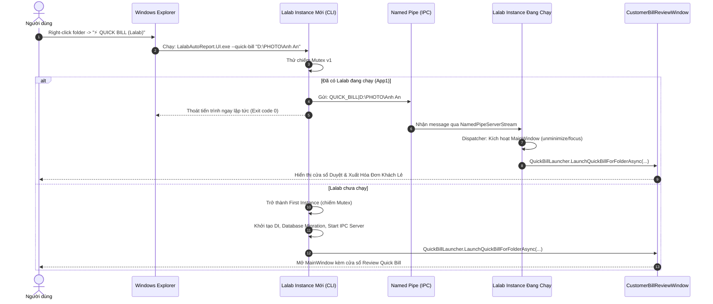
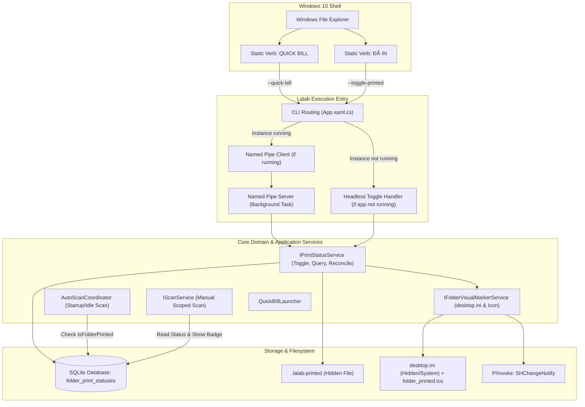
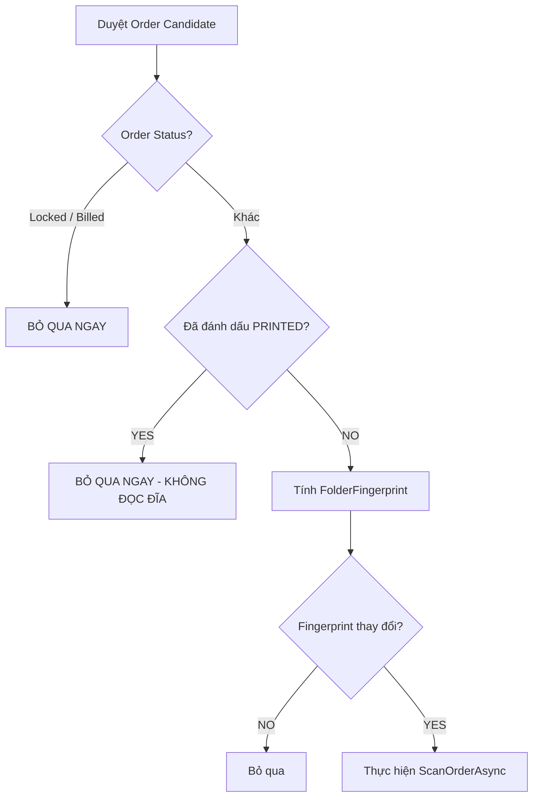

# Lalab Auto Report — Printed Folder Explorer Integration Plan

> **Tài liệu đặc tả kiến trúc & kế hoạch triển khai tính năng tích hợp Windows Explorer: Đánh dấu ĐÃ IN (Toggle) và Quản lý Quick Bill.**
>
> **Mục tiêu môi trường:** Windows 10 (Local-First Desktop Application)  
> **Nguyên tắc chủ đạo:** Đúng đắn nghiệp vụ (Correctness) > Bảo toàn cấu trúc tệp (Folder Provenance) > Tiết kiệm tài nguyên (Zero Idle CPU/IO) > Đơn giản trong vận hành (Operational Simplicity).  
> **Trạng thái:** ĐÃ TRIỂN KHAI VÀ NGHIỆM THU HOÀN TẤT (312/312 TESTS PASS, BUILD THÀNH CÔNG, LGTM).

---

## 1. STATUS / RECOMMENDATION

### 1.1 Tóm tắt hiện trạng
Hệ thống **Lalab Auto Report V2** hiện đã hoàn thiện kiến trúc 3 tầng: Core Domain (`LalabAutoReport.Core`), Hạ tầng (`LalabAutoReport.Infrastructure`), và Giao diện (`LalabAutoReport.UI`). Hệ thống đã có sẵn:
1. **Quick Bill Context Menu:** Đã có service `WindowsContextMenuIntegrationService` đăng ký static verb trong Registry (`HKCU\Software\Classes\Directory\shell\LalabQuickBill`), hỗ trợ tham số dòng lệnh `--quick-bill "%1"` và `--quick-bill "%V"`.
2. **IPC & Single-Instance Routing:** `App.xaml.cs` đã tích hợp sẵn Mutex `Local\LalabAutoReport_SingleInstance_Mutex_v1` và Named Pipe `LalabAutoReport_IpcPipe_v1`. Khi có instance đang chạy, lệnh CLI gửi pipe message `QUICK_BILL|<path>` sang instance chính và thoát êm trong < 50ms.
3. **Smart Scan & Fingerprint:** Đã có `AutoScanCoordinator` quản lý Startup Smart Scan và Idle Smart Scan, sử dụng `FolderFingerprintService` và cơ chế lọc bỏ các đơn `Locked` / `Billed`.
4. **Path Normalization:** Đã có `PathNormalizer.Normalize()` xử lý chuẩn hoá đường dẫn Windows (invariants, case-insensitive, forward/back slashes, trim trailing slash, resolve full path).

### 1.2 Khuyến nghị cốt lõi (Core Recommendations)
1. **Explorer Context Menu:** Bổ sung đúng 01 command duy nhất `ĐÃ IN` cạnh `QUICK BILL` trong Windows File Explorer (classic context menu cho Windows 10 thông qua Registry `HKCU`). Không dùng COM Shell Extension hay IExplorerCommand phức tạp.
2. **Cơ chế Toggle hai chiều:** Chỉ dùng duy nhất một menu item `ĐÃ IN`. Click lần 1: Đánh dấu `PRINTED`, folder đổi sang màu đỏ, ghi nhận DB + marker, loại khỏi tự động scan. Click lần 2: Bỏ đánh dấu `PRINTED`, folder trở lại màu vàng mặc định, xóa marker, phục hồi quyền auto-scan.
3. **Không đổi tên thư mục:** Giữ nguyên 100% đường dẫn và basename của thư mục (`D:\...\Anh An` hoặc `D:\...\Don 01`). Tuyệt đối không thêm tiền tố `[ĐÃ IN]`.
4. **Biểu hiện trực quan (Visual Appearance):** Sử dụng cơ chế gốc của Windows 10: `desktop.ini` bên trong folder trỏ đến icon chung `%LocalAppData%\LalabAutoReport\Assets\folder_printed.ico`, kết hợp folder attribute `ReadOnly` và API `SHChangeNotify` để cập nhật tức thì icon màu đỏ trong Explorer.
5. **Nguồn sự thật kép an toàn (Hybrid Source of Truth):**
   - **Database SQLite = Primary Truth** (nguồn chân lý chính cho logic nghiệp vụ, báo cáo, Auto-Scan skip).
   - **Hidden Marker File (`.lalab-printed`) = Portable Recovery Hint** (đi theo folder khi copy/di chuyển, phục hồi trạng thái khi scan phát hiện).
   - **`desktop.ini` + Icon đỏ = Visual Decoration Only** (chỉ phục vụ mắt nhìn người dùng trong Explorer; lỗi icon không làm mất trạng thái nghiệp vụ).
6. **Smart Scan Integration:** Khi AutoScan (Startup Scan / Idle Scan) duyệt danh sách đơn hàng, kiểm tra cờ `PRINTED` sớm nhất có thể để **bỏ qua ngay lập tức trước khi đọc fingerprint hay quét I/O thư mục con**.
7. **Thao tác thủ công không bị khóa:** Folder `PRINTED` vẫn được phép chạy `Manual Scan` hoặc `QUICK BILL` nếu người dùng chủ động yêu cầu.

---

## 2. CURRENT IMPLEMENTATION AUDIT

### 2.1 Thành phần hiện có liên quan đến Context Menu & Explorer
| Thành phần | Vị trí file | Đánh giá hiện trạng | Khả năng tái sử dụng |
|---|---|---|---|
| `IContextMenuIntegrationService` | `src/LalabAutoReport.Core/Interfaces/IContextMenuIntegrationService.cs` | Interface quản lý đăng ký/gỡ bỏ menu chuột phải và sinh file `.reg`. Hiện tại chỉ phục vụ Quick Bill (`LalabQuickBill`). | Mở rộng interface để hỗ trợ đăng ký đồng thời cả `QUICK BILL` và `ĐÃ IN` (hoặc cấu hình từng verb). |
| `WindowsContextMenuIntegrationService` | `src/LalabAutoReport.Infrastructure/Windows/WindowsContextMenuIntegrationService.cs` | Triển khai đăng ký Registry `HKCU\Software\Classes\Directory\shell\LalabQuickBill` và `Directory\Background\shell\LalabQuickBill`. Xử lý đường dẫn exe và icon `quick_bill.ico`. | **Tái sử dụng 100% mô hình Registry static verb**. Thêm key `LalabTogglePrinted` với pattern tương tự. |
| `Install_QuickBill_ContextMenu.ps1` & `Uninstall...ps1` | Thư mục gốc dự án | Script PowerShell mẫu đăng ký thủ công menu Quick Bill cho môi trường dev/staging. | Bổ sung phần đăng ký `ĐÃ IN` vào bộ script tiện ích. |
| `ContextMenuIntegrationTests.cs` | `tests/LalabAutoReport.Tests/ContextMenuIntegrationTests.cs` | Bộ unit test kiểm tra sinh file `.reg`, ghi Registry, và toggle setting `AutoRegisterContextMenu`. | Mở rộng test coverage cho verb `ĐÃ IN`. |

### 2.2 Thành phần khởi động & định tuyến Command-Line (CLI & Single-Instance)
| Thành phần | Vị trí file | Đánh giá hiện trạng | Khả năng tái sử dụng |
|---|---|---|---|
| Mutex Single-Instance | `src/LalabAutoReport.UI/App.xaml.cs` (line 25, 48) | `Local\LalabAutoReport_SingleInstance_Mutex_v1` kiểm soát chạy 1 tiến trình. | Tái sử dụng nguyên vẹn. |
| Named Pipe Server/Client | `src/LalabAutoReport.UI/App.xaml.cs` (line 26, 64, 204) | Pipe `LalabAutoReport_IpcPipe_v1` truyền thông điệp giữa các tiến trình. Hiện tại hỗ trợ message `QUICK_BILL\|{folder}` và `ACTIVATE\|`. | **Tái sử dụng nguyên vẹn**. Chỉ cần bổ sung handler cho message `TOGGLE_PRINTED\|{folder}`. |
| Phân tích Args | `App.xaml.cs` (line 33-42) | Kiểm tra `e.Args` tìm `--quick-bill`. | Bổ sung kiểm tra `--toggle-printed` và chế độ chạy nền không hiện cửa sổ lớn (Headless Fast Toggle). |
| `QuickBillLauncher` | `src/LalabAutoReport.UI/Services/QuickBillLauncher.cs` | Nhận folder, chuẩn hoá path, xác định tên khách, build draft bill và mở cửa sổ `CustomerBillReviewWindow`. | Tái sử dụng cho luồng Quick Bill khi người dùng chọn folder PRINTED. |

### 2.3 Thành phần Quét & Nhận diện (Scanner & Smart Scan)
| Thành phần | Vị trí file | Đánh giá hiện trạng | Tích hợp PRINTED |
|---|---|---|---|
| `AutoScanCoordinator` | `src/LalabAutoReport.Core/Services/AutoScanCoordinator.cs` | `ScanScopeWithFingerprintsAsync` duyệt các đơn hàng trong ngày. Hiện tại bỏ qua các đơn có trạng thái `OrderStatus.Locked` hoặc `OrderStatus.Billed`. | **Điểm can thiệp chính**: Bổ sung điều kiện bỏ qua ngay nếu thư mục/đơn hàng có cờ `PRINTED` (trước khi tính `FolderFingerprint`). |
| `FolderFingerprintService` | `src/LalabAutoReport.Core/Services/FolderFingerprintService.cs` | Đọc metadata thư mục con để kiểm tra thay đổi. | Tránh gọi service này với các thư mục PRINTED nhằm tiết kiệm IO tối đa. |
| `ScanService` | `src/LalabAutoReport.Core/Services/ScanService.cs` | Quét theo phạm vi `Date`, `Order`, `Specification`. | Khi quét thủ công (Manual Scan), vẫn quét bình thường và nạp cờ `IsPrinted` lên entity để UI hiển thị badge. |
| `PathNormalizer` | `src/LalabAutoReport.Core/Services/PathNormalizer.cs` | Chuẩn hoá đường dẫn Windows thành chữ thường, bỏ slash cuối, resolve absolute full path. | Dùng làm chuẩn duy nhất để so khớp đường dẫn folder PRINTED. |

---

## 3. EXISTING QUICK BILL INTEGRATION

### 3.1 Cấu trúc Registry hiện tại của Quick Bill
Hệ thống hiện đang sử dụng **Static Shell Verbs** dưới nhánh `HKEY_CURRENT_USER` (HKCU). Đây là giải pháp tối ưu cho ứng dụng local Windows 10/11 vì:
- Không yêu cầu quyền Administrator hay quyền nâng cao (UAC prompt).
- Dễ dàng đăng ký/hủy bỏ sạch sẽ khi cài đặt hoặc thay đổi thiết lập trong UI Settings.
- Hoàn toàn ổn định, không gây crash Windows Explorer như các COM in-process dll.

**Chi tiết Registry Keys hiện hữu:**
```text
[HKEY_CURRENT_USER\Software\Classes\Directory\shell\LalabQuickBill]
@="⚡ QUICK BILL (Lalab)"
"Icon"="\"C:\\Path\\To\\quick_bill.ico\""

[HKEY_CURRENT_USER\Software\Classes\Directory\shell\LalabQuickBill\command]
@="\"C:\\Path\\To\\LalabAutoReport.UI.exe\" --quick-bill \"%1\""

[HKEY_CURRENT_USER\Software\Classes\Directory\Background\shell\LalabQuickBill]
@="⚡ QUICK BILL (Lalab)"
"Icon"="\"C:\\Path\\To\\quick_bill.ico\""

[HKEY_CURRENT_USER\Software\Classes\Directory\Background\shell\LalabQuickBill\command]
@="\"C:\\Path\\To\\LalabAutoReport.UI.exe\" --quick-bill \"%V\""
```

### 3.2 Luồng xử lý khi người dùng click Quick Bill


### 3.3 Đánh giá và hướng tái sử dụng
Cơ chế trên đã được kiểm chứng hoạt động hoàn hảo, đáp ứng:
- Không bị xung đột đa tiến trình.
- Truyền tham số đường dẫn Unicode tiếng Việt và dấu khoảng trắng an toàn qua Named Pipe UTF-8.
- Kích hoạt cửa sổ mượt mà.
**Kết luận:** Triển khai chức năng `ĐÃ IN` phải kế thừa chính xác 100% kiến trúc Registry static verb, Mutex và Named Pipe này.

---

## 4. BUSINESS REQUIREMENTS

| # | Yêu cầu nghiệp vụ | Mô tả chi tiết | Khóa nghiệp vụ |
|---|---|---|---|
| **BR-01** | Đúng 2 chức năng | Menu chuột phải Explorer chỉ gồm: `QUICK BILL` và `ĐÃ IN`. | Không thêm menu phức tạp. |
| **BR-02** | Toggle hai chiều | Nhấp lần 1: Chưa in -> Đã in (`PRINTED`). Nhấp lần 2: Đang in -> Hủy in (`NOT_PRINTED`). | Chỉ 1 verb `ĐÃ IN`, không tạo menu "Bỏ đã in". |
| **BR-03** | Không đổi tên folder | Tuyệt đối không đổi tên thư mục trên đĩa (không gắn `[ĐÃ IN]`). Đường dẫn thư mục phải bất biến. | Bảo toàn provenance, audit trail, đường dẫn DB. |
| **BR-04** | Đổi màu icon Explorer | Khi `PRINTED`, folder hiển thị icon màu đỏ trong Windows Explorer. Khi hủy, trở về icon mặc định. | Nhận diện trực quan ngay trong Explorer. |
| **BR-05** | Tách biệt Billing | `PRINTED` là trạng thái sản xuất. KHÔNG đồng nghĩa với `Billed`, `Locked`, `Exported`, `Paid`. | Không tự động khóa bill khi in; không tự đánh dấu in khi xuất bill. |
| **BR-06** | Đơn vị Toggle (Unit) | Chính thư mục được click là đối tượng áp dụng (Order, hoặc Product folder). Không có `PARTIALLY_PRINTED`. | Đơn giản hóa trạng thái; người dùng chủ động click đúng cấp mong muốn. |
| **BR-07** | Bỏ qua Auto-Scan | Folder đang `PRINTED` bị loại bỏ khỏi mọi cơ chế tự động quét (Startup Scan, Idle Scan, auto background check). | Tiết kiệm tối đa tài nguyên I/O ổ đĩa và CPU. |
| **BR-08** | Không khóa thao tác thủ công | Người dùng chủ động chạy `Manual Scan` hoặc `QUICK BILL` trên folder `PRINTED` vẫn được xử lý bình thường. | Tránh việc nhân viên bị block công việc khi cần kiểm tra lại đơn cũ. |

---

## 5. RECOMMENDED ARCHITECTURE

### 5.1 Sơ đồ kiến trúc tổng thể


### 5.2 Ranh giới trách nhiệm (Separation of Concerns)
1. **`IPrintStatusService` (Core Domain):**
   - Xác định trạng thái in hiện tại của một thư mục (kết hợp DB và Marker file).
   - Thực hiện nghiệp vụ Toggle: chuyển đổi qua lại giữa `PRINTED` và `NOT_PRINTED`.
   - Cung cấp phương thức kiểm tra nhanh `IsFolderPrintedAsync(normalizedPath)` để Scanner sử dụng.
   - Quản lý reconciliation khi phát hiện sai lệch giữa DB và filesystem.
2. **`IFolderVisualMarkerService` (Infrastructure Windows):**
   - Phụ trách độc lập việc tạo/xóa `desktop.ini`, thiết lập thuộc tính thư mục (`FileAttributes.ReadOnly`) và thuộc tính tệp (`Hidden | System`).
   - Gọi P/Invoke Windows Shell API (`SHChangeNotify`) để yêu cầu Windows Explorer làm mới icon.
   - Xử lý cô lập lỗi: Lỗi Explorer icon cache không bao giờ làm hỏng trạng thái nghiệp vụ.
3. **`IContextMenuIntegrationService` (Infrastructure Windows):**
   - Đăng ký và gỡ bỏ 2 verb `LalabQuickBill` và `LalabTogglePrinted` trong `HKCU\Software\Classes\Directory\shell`.
4. **`AutoScanCoordinator` (Core/Application):**
   - Nhận diện đơn hàng mới hoặc kiểm tra thay đổi.
   - Truy vấn nhanh danh sách các thư mục `PRINTED` để loại bỏ khỏi danh sách cần tính fingerprint và quét sâu.

---

## 6. PRINTED STATE MODEL

### 6.1 Mô hình Domain tối giản
Trạng thái `PRINTED` chỉ đại diện cho việc thư mục ảnh này đã hoàn thành công đoạn in vật lý tại xưởng.

```csharp
namespace LalabAutoReport.Core.Domain;

/// <summary>
/// Trạng thái in ấn của thư mục trong xưởng
/// </summary>
public enum PrintStatus
{
    NotPrinted = 0,
    Printed = 1
}

/// <summary>
/// Bản ghi lưu vết trạng thái in của một thư mục cụ thể
/// </summary>
public class FolderPrintRecord
{
    public long Id { get; set; }
    public string FolderPath { get; set; } = string.Empty;
    public string NormalizedPath { get; set; } = string.Empty; // PathNormalizer output
    public PrintStatus Status { get; set; } = PrintStatus.Printed;
    public DateTimeOffset MarkedAt { get; set; } = DateTimeOffset.UtcNow;
    public string? MarkedBy { get; set; } // "ExplorerContextMenu", "QuickBill", "ManualUI"
    public long? AssociatedOrderId { get; set; } // Liên kết Order nếu khớp đường dẫn
}
```

### 6.2 Kết quả thao tác Toggle (Result Object)
```csharp
public class TogglePrintStatusResult
{
    public string FolderPath { get; set; } = string.Empty;
    public PrintStatus PreviousStatus { get; set; }
    public PrintStatus NewStatus { get; set; }
    public bool IsSuccess { get; set; }
    public bool VisualIconUpdated { get; set; }
    public string? ErrorMessage { get; set; }
}
```

---

## 7. SOURCE OF TRUTH (NGUỒN SỰ THẬT)

Hệ thống tuân thủ mô hình **Hybrid Tiered Truth** được xác định rạch ròi theo thứ tự ưu tiên:

```text
[TẦNG 1: PRIMARY SOURCE OF TRUTH]
       SQLite Database (`folder_print_statuses`)
       → Chịu trách nhiệm về trạng thái nghiệp vụ, kiểm tra tự động scan, báo cáo.
                         │
                         ▼
[TẦNG 2: PORTABLE & RECOVERY HINT]
       Hidden Marker File (`.lalab-printed`)
       → Lưu trên đĩa cùng folder; bảo toàn trạng thái khi di chuyển folder hoặc restore DB.
                         │
                         ▼
[TẦNG 3: VISUAL DECORATION ONLY]
       `desktop.ini` + `folder_printed.ico` + Explorer Icon Cache
       → Chỉ phục vụ hiển thị trực quan cho mắt người dùng trong Windows Explorer.
       → KHÔNG BAO GIỜ là nguồn sự thật để quyết định logic nghiệp vụ.
```

### Quy tắc hòa giải (Reconciliation Rules) deterministic:
1. **DB có bản ghi `PRINTED`, nhưng filesystem không có `.lalab-printed`:**
   - *Nguyên nhân:* Người dùng vô tình xóa file ẩn, hoặc folder được copy sang thư mục khác nhưng đường dẫn cũ vẫn còn.
   - *Quy tắc:* Giữ nguyên trạng thái `PRINTED` trong DB. Khi có yêu cầu hoặc khi quét, app tự động ghi lại file `.lalab-printed` và tái lập `desktop.ini`.
2. **Filesystem có `.lalab-printed`, nhưng DB chưa có (hoặc DB restored từ backup cũ):**
   - *Nguyên nhân:* Database bị khôi phục từ bản backup cũ, hoặc folder ảnh được copy từ một máy khác về.
   - *Quy tắc:* File marker trên đĩa là bằng chứng vật lý rằng folder đã in. Scanner hoặc Toggle Service tự động nạp bản ghi `PRINTED` vào SQLite để đồng bộ hóa.
3. **Người dùng bấm Toggle:**
   - Trạng thái mới được xác định dựa trên: Nếu DB có `PRINTED` HOẶC marker file tồn tại -> Coi là đang `PRINTED`, thao tác toggle sẽ chuyển về `NOT_PRINTED` (xóa cả 2). Ngược lại -> Chuyển sang `PRINTED` (ghi cả 2).
4. **`desktop.ini` bị mất hoặc lỗi icon cache:**
   - Trạng thái nghiệp vụ vẫn là `PRINTED` 100%. Auto-scan vẫn bỏ qua. Người dùng có thể chạy lệnh "Sửa/Làm mới icon" từ menu nếu cần.

---

## 8. MARKER STRATEGY

### 8.1 So sánh 3 phương án lưu trữ
| Tiêu chí | Phương án A: Database Only | Phương án B: Marker File Only | Phương án C: Database + Marker (Khuyến nghị) |
|---|---|---|---|
| **Độ sạch của thư mục** | Tuyệt đối sạch | Có thêm 1 file ẩn `.lalab-printed` | Có thêm 1 file ẩn `.lalab-printed` |
| **Tốc độ truy vấn Auto-Scan** | Siêu nhanh (truy vấn DB in-memory/indexed) | Chậm (phải kiểm tra file disk cho từng folder) | **Tối ưu:** Query indexed DB trước; chỉ đọc disk khi quét mới |
| **Khả năng mang theo (Portability)** | Kém (mất trạng thái khi copy folder ra máy khác hoặc sang ổ khác) | Hoàn hảo (file đi liền với folder) | **Hoàn hảo:** File marker đi theo folder, tự nạp lại vào DB khi scan |
| **Khôi phục sau sự cố mất DB** | Mất toàn bộ lịch sử in ấn | Còn nguyên trạng thái | **Còn nguyên:** Tự động đồng bộ lại từ marker |
| **Bảo vệ toàn vẹn lịch sử** | Rất tốt (lưu timestamp, audit) | Kém (chỉ là file text) | **Rất tốt:** DB lưu audit chi tiết, marker là mỏ neo dự phòng |

### 8.2 Định dạng và thuộc tính của `.lalab-printed`
- **Tên tệp:** `.lalab-printed` (phù hợp quy ước tệp metadata hiện đại, không gây nhầm lẫn với ảnh).
- **Thuộc tính tệp Windows:** `FileAttributes.Hidden`.
- **Nội dung tệp:** JSON UTF-8 nhỏ gọn (~80 bytes):
  ```json
  {"status":"PRINTED","markedAt":"2026-09-30T10:30:00Z","version":1}
  ```
- **Tác động đến đếm số lượng:**
  `FolderStructureParser` và `PrintFolderResolver` chỉ lọc các file có extension ảnh hợp lệ (`.jpg`, `.jpeg`, `.png`, v.v.). Tệp `.lalab-printed` **hoàn toàn bị bỏ qua**, không ảnh hưởng đến số đếm file in.

---

## 9. WINDOWS 10 CONTEXT MENU

### 9.1 Kiến trúc Context Menu: Top-Level vs Submenu
Có hai cách tổ chức trên Windows 10:

#### Cách 1: Hai mục Top-Level riêng biệt (Khuyến nghị cho xưởng in)
```text
[Right-click folder]
  ├── Mở trong cửa sổ mới
  ├── Ghim vào Truy cập nhanh
  ├── ...
  ├── ⚡ QUICK BILL (Lalab)
  ├── 🏷️ ĐÃ IN (Lalab)
  └── ...
```
- **Ưu điểm:** Thao tác cực nhanh, **chỉ cần 1 click**. Thợ in và nhân viên lễ tân thao tác hàng trăm lần mỗi ngày không phải rê chuột qua submenu.
- **Tính nhất quán:** Kế thừa trực tiếp key `LalabQuickBill` hiện hành.

#### Cách 2: Submenu gộp "Lalab Auto Report"
```text
[Right-click folder]
  ├── Lalab Auto Report  ► ├── ⚡ QUICK BILL
  │                       └── 🏷️ ĐÃ IN
```
- **Ưu điểm:** Gọn gàng menu chuột phải.
- **Nhược điểm:** Tăng thao tác (2 clicks + rê chuột), chậm hơn trong quy trình sản xuất thực tế.

**Lựa chọn khuyến nghị:** Sử dụng **Cách 1 (2 mục Top-Level)** để tối ưu tốc độ bấm cho nhân viên xưởng.

### 9.2 Chi tiết cấu hình Registry cho `ĐÃ IN`
Đăng ký trực tiếp trong `HKEY_CURRENT_USER` (HKCU):

```text
; 1. Menu trên thư mục (Directory)
[HKEY_CURRENT_USER\Software\Classes\Directory\shell\LalabTogglePrinted]
@="🏷️ ĐÃ IN (Lalab)"
"Icon"="\"%LocalAppData%\\LalabAutoReport\\Assets\\folder_printed.ico\""

[HKEY_CURRENT_USER\Software\Classes\Directory\shell\LalabTogglePrinted\command]
@="\"C:\\Path\\To\\LalabAutoReport.UI.exe\" --toggle-printed \"%1\""

; 2. Menu trong khoảng trống thư mục (Directory Background)
[HKEY_CURRENT_USER\Software\Classes\Directory\Background\shell\LalabTogglePrinted]
@="🏷️ ĐÃ IN (Lalab)"
"Icon"="\"%LocalAppData%\\LalabAutoReport\\Assets\\folder_printed.ico\""

[HKEY_CURRENT_USER\Software\Classes\Directory\Background\shell\LalabTogglePrinted\command]
@="\"C:\\Path\\To\\LalabAutoReport.UI.exe\" --toggle-printed \"%V\""
```

### 9.3 Chống Command Injection & Xử lý ký tự đặc biệt
- Khóa cứng tham số bọc trong dấu ngoặc kép: `\"%1\"` và `\"%V\"`.
- Trong mã nguồn C#, sử dụng `PathNormalizer.Normalize()` để phân giải full path an toàn trước khi xử lý, loại bỏ các ký tự điều khiển trái phép.

---

## 10. CLI / SINGLE INSTANCE ROUTING

### 10.1 Command-Line Specification
Ứng dụng hỗ trợ 2 cờ dòng lệnh tiêu chuẩn:
```text
LalabAutoReport.UI.exe --quick-bill "<FolderFullPath>"
LalabAutoReport.UI.exe --toggle-printed "<FolderFullPath>"
```

### 10.2 Luồng xử lý Toggle: Đang chạy vs Chưa chạy (Headless Mode)
Đây là thiết kế trải nghiệm người dùng (UX) mang tính đột phá:

#### Kịch bản A: Ứng dụng Lalab đang chạy (Instance đã mở)
1. Tiến trình mới khởi động với `--toggle-printed "<folder>"`.
2. Kiểm tra Mutex -> Phát hiện instance đang chạy.
3. Mở kết nối Named Pipe `LalabAutoReport_IpcPipe_v1`.
4. Gửi thông điệp: `TOGGLE_PRINTED|<FolderFullPath>`.
5. Tiến trình mới thoát ngay lập tức (Exit code 0, thời gian thực thi < 40ms).
6. Instance chính nhận thông điệp qua Named Pipe:
   - Gọi `IPrintStatusService.TogglePrintedStatusAsync(folder)`.
   - Cập nhật database và visual icon.
   - **KHÔNG cướp quyền focus (focus stealing) hay giật cửa sổ lên màn hình**, chỉ cập nhật ngầm trạng thái và hiển thị thông báo nhẹ trên thanh trạng thái (Status Bar) hoặc Windows Toast nếu cần.

#### Kịch bản B: Ứng dụng Lalab CHƯA chạy (Cold Start)
Nếu người dùng click chuột phải `ĐÃ IN` khi ứng dụng chính đang đóng:
- Người dùng **chỉ muốn folder chuyển màu đỏ trong Explorer**, họ không có nhu cầu mở toang giao diện Dashboard làm gián đoạn công việc dọn dẹp file.
- **Giải pháp Headless Execution:**
  1. Tiến trình khởi động nhận thấy `--toggle-printed`.
  2. Bỏ qua việc nạp giao diện WPF (`MainWindow.Show()`).
  3. Khởi tạo tối giản Service Provider (chỉ gồm SQLite + Filesystem + VisualMarkerService).
  4. Thực thi Toggle (ghi DB, ghi `.lalab-printed`, ghi `desktop.ini`, gọi `SHChangeNotify`).
  5. Thoát tiến trình ngay lập tức với Exit code 0 (toàn bộ quá trình chỉ mất ~250ms).
  6. Folder trên Explorer chuyển sang màu đỏ tức thì mà không hề bật cửa sổ app lên màn hình!

---

## 11. RED FOLDER ICON STRATEGY

### 11.1 Cơ chế Windows 10 Native Folder Customization
Windows Explorer tích hợp sẵn cơ chế tùy biến icon thư mục thông qua tệp `desktop.ini`. Để kích hoạt thành công trên Windows 10, **bắt buộc phải thỏa mãn đồng thời 3 điều kiện kỹ thuật**:

1. **Thuộc tính thư mục (Folder Attribute):**
   - Thư mục chứa phải được gán thuộc tính **`FileAttributes.ReadOnly`** (hoặc `System`).
   - *Lưu ý quan trọng:* Trên hệ điều hành Windows, thuộc tính `ReadOnly` áp dụng trên thư mục (Directory) không hề ngăn cản việc ghi, sửa hay xóa tệp bên trong thư mục! Windows Explorer chỉ dùng cờ này làm tín hiệu đánh dấu để hệ thống biết cần phải đọc tệp `desktop.ini` bên trong.
2. **Thuộc tính tệp `desktop.ini`:**
   - Tệp `desktop.ini` bắt buộc phải có thuộc tính: **`FileAttributes.Hidden | FileAttributes.System`**. Nếu thiếu 2 cờ này, Explorer sẽ bỏ qua và không áp dụng icon.
3. **Cấu trúc nội dung tệp `desktop.ini`:**
   ```ini
   [.ShellClassInfo]
   IconResource=C:\Users\Admin\AppData\Local\LalabAutoReport\Assets\folder_printed.ico,0
   [ViewState]
   Mode=
   Vid=
   FolderType=Generic
   ```

### 11.2 So sánh vị trí lưu trữ File Icon (.ico)
| Tiêu chí | Lựa chọn 1: Shared Icon trong AppData (Khuyến nghị) | Lựa chọn 2: Icon chép vào từng folder |
|---|---|---|
| **Vị trí** | `%LocalAppData%\LalabAutoReport\Assets\folder_printed.ico` | `<Folder>\folder_printed.ico` |
| **Độ sạch folder** | Thư mục ảnh hoàn toàn sạch sẽ, không có file nhị phân rác. | Mỗi folder in sinh ra 1 file `.ico` ~50KB. 1000 đơn in = 1000 file rác. |
| **Bảo trì / Thay đổi icon** | Thay đổi 1 file duy nhất là toàn bộ các folder cập nhật theo. | Phải sửa từng file trong hàng nghìn thư mục. |
| **Khi gỡ cài đặt app** | Nếu xóa file icon, Explorer tự động hiển thị lại icon vàng mặc định (không crash). | File `.ico` bị bỏ lại rải rác khắp ổ đĩa của xưởng. |
| **Tính di động sang máy khác** | Nếu copy sang máy khác không có Lalab, folder hiển thị icon vàng mặc định. | Giữ được icon đỏ nếu đường dẫn trong desktop.ini là relative. |

**Kết luận:** Chọn **Lựa chọn 1 (Shared Icon)** vì giữ sạch ổ cứng cho xưởng in, không gây rác và quản lý tập trung hoàn hảo.

---

## 12. DESKTOP.INI / EXPLORER REFRESH

### 12.1 Vấn đề Explorer Icon Caching & Giải pháp
Windows Explorer lưu cache icon thư mục rất chặt chẽ trong RAM và tệp `IconCache.db`. Nếu chỉ ghi tệp `desktop.ini` mà không thông báo, Explorer sẽ không vẽ lại icon cho đến khi người dùng nhấn F5 hoặc khởi động lại Explorer.

Để icon màu đỏ xuất hiện **ngay lập tức trong 0.1 giây**, ứng dụng sử dụng Windows Shell API chính thống qua P/Invoke:

```csharp
[DllImport("shell32.dll", CharSet = CharSet.Auto, SetLastError = true)]
public static extern void SHChangeNotify(
    int wEventId, 
    uint uFlags, 
    IntPtr dwItem1, 
    IntPtr dwItem2
);
```

**Các tham số tối ưu:**
- `wEventId = 0x00002000` (`SHCNE_UPDATEITEM`): Thông báo mục cụ thể đã thay đổi.
- Kết hợp bổ sung `0x00000800` (`SHCNE_ATTRIBUTES`): Thông báo thuộc tính thư mục đã thay đổi.
- `uFlags = 0x0005` (`SHCNF_PATHW`): Đường dẫn Unicode đầy đủ.
- `dwItem1 = Marshal.StringToHGlobalUni(folderPath)`.

### 12.2 Quy trình Toggle Bật (Turn ON): `NOT_PRINTED` → `PRINTED`
1. Kiểm tra file icon dùng chung `%LocalAppData%\LalabAutoReport\Assets\folder_printed.ico` có tồn tại (nếu chưa, trích xuất từ Resource nhúng của app).
2. Kiểm tra/Tạo tệp `desktop.ini` bên trong folder:
   - Xóa bỏ thuộc tính ẩn/hệ thống cũ nếu có để cho phép ghi đè.
   - Ghi nội dung trỏ đến đường dẫn icon đỏ.
   - Gán lại thuộc tính: `Hidden | System`.
3. Gán thuộc tính thư mục: `File.SetAttributes(folderPath, currentAttrs | FileAttributes.ReadOnly)`.
4. Gọi `SHChangeNotify(SHCNE_UPDATEITEM | SHCNE_ATTRIBUTES)`.

### 12.3 Quy trình Toggle Tắt (Turn OFF): `PRINTED` → `NOT_PRINTED`
1. Kiểm tra nếu tệp `desktop.ini` tồn tại:
   - Xóa bỏ thuộc tính `Hidden | System`.
   - Xóa tệp `desktop.ini`.
2. Gỡ bỏ thuộc tính `ReadOnly` của thư mục:
   - `File.SetAttributes(folderPath, currentAttrs & ~FileAttributes.ReadOnly)`.
3. Gọi `SHChangeNotify(SHCNE_UPDATEITEM | SHCNE_ATTRIBUTES)`.
4. Explorer lập tức thu hồi icon đỏ và hoàn trả icon thư mục vàng mặc định của Windows.

### 12.4 Ổ đĩa mạng (NAS / Network Shared Folders)
Nếu xưởng lưu file trên máy chủ mạng LAN qua UNC path (`\\SERVER\Photos\...`):
- Windows Explorer đôi khi vô hiệu hóa việc đọc `desktop.ini` trên network share vì lý do hiệu năng mạng.
- Xử lý: Trong kế hoạch triển khai, trạng thái nghiệp vụ `PRINTED` và việc bỏ qua Auto-Scan được bảo toàn 100% qua Database và file `.lalab-printed`. Biểu hiện icon đỏ là tính năng phụ trợ (best-effort decoration); nếu Explorer mạng không vẽ icon, hệ thống vẫn hoạt động chính xác tuyệt đối.

---

## 13. SMART SCAN INTEGRATION

### 13.1 Chiến lược Bỏ Qua (Early Exclusion Policy)
Mục tiêu cốt lõi của tính năng `ĐÃ IN` là **loại bỏ các thư mục đã sản xuất xong khỏi phạm vi quét tự động** nhằm đưa mức tiêu thụ tài nguyên của ứng dụng về gần 0% tuyệt đối.

Trong `AutoScanCoordinator.cs`:
Hiện tại quy trình quét `ScanScopeWithFingerprintsAsync` gồm:
1. Đọc danh sách thư mục ngày.
2. Với mỗi Order: Đọc DB -> Kiểm tra `Locked` hoặc `Billed`.
3. **Tính `FolderFingerprint`** (duyệt cây thư mục đĩa).
4. Nếu thay đổi -> Gọi `ScanService.ScanOrderAsync`.

**Cải tiến khi tích hợp `PRINTED`:**


**Lợi ích vượt trội:**
Kiểm tra cờ `PRINTED` từ Database **trước khi tính `FolderFingerprint`**. Ứng dụng không cần chạm vào ổ đĩa để duyệt hàng nghìn tệp ảnh cũ.

### 13.2 Các phạm vi Quét Tự Động bị chặn
1. **Startup Smart Scan:** Không bao giờ quét lại các thư mục `PRINTED` từ hôm qua hoặc sáng nay.
2. **Idle Smart Scan:** Khi máy tính ở trạng thái nghỉ, vòng lặp Idle Scan bỏ qua toàn bộ các folder `PRINTED` trong cửa sổ ngày cấu hình (7 ngày).
3. **Background Check:** Mọi kiểm tra ngầm định kỳ đều bỏ qua.

### 13.3 Thao tác Quét Thủ Công (Manual Scan)
- Nếu người dùng bấm trực tiếp nút **"Quét Ngày"**, **"Quét Phạm Vi"**, hoặc chuột phải chọn **"Quét lại đơn này"** trên giao diện:
  - Ứng dụng **VẪN THỰC HIỆN QUÉT BÌNH THƯỜNG**.
  - Không tự ý hủy trạng thái `PRINTED`.
  - Trên bảng Dashboard, đơn hàng hiển thị huy hiệu (badge) màu đỏ/tím rõ nét: `🏷️ ĐÃ IN` để người dùng phân biệt.

---

## 14. QUICK BILL INTERACTION

### 14.1 Nguyên tắc tương tác
`QUICK BILL` và `ĐÃ IN` phục vụ hai mục đích hoàn toàn độc lập:
- `QUICK BILL` = Nghiệp vụ tài chính / Tính tiền nhanh cho khách lẻ hoặc khách vãng lai.
- `ĐÃ IN` = Nghiệp vụ sản xuất / Đã đưa file vào máy in ảnh.

### 14.2 Các kịch bản phối hợp
1. **Thực hiện Quick Bill trên một folder ĐÃ IN (`PRINTED`):**
   - Hoàn toàn cho phép. Quick Bill tiến hành quét file trong folder, tính bill theo bảng giá và mở cửa sổ `CustomerBillReviewWindow`.
   - Thao tác này **không làm mất trạng thái `PRINTED`** của folder.
2. **Xuất hóa đơn Quick Bill (Export Bill) có tự động đánh dấu `PRINTED` không?**
   - **KHÔNG.** Tránh việc tự động hóa ngầm ngoài ý muốn của người dùng. Có những đơn thanh toán tiền trước nhưng 2 ngày sau mới in; hoặc in xong rồi mới tính bill. Hai trạng thái hoàn toàn độc lập.
3. **Trùng lặp thư mục trong Quick Bill:**
   - Hệ thống giữ nguyên cơ chế cảnh báo trùng lặp `CheckDuplicateSourceFoldersAsync` nếu thư mục đã từng nằm trong một hóa đơn Locked trước đó.

---

## 15. PATH / MOVE / RENAME HANDLING

### 15.1 Chuẩn hoá đường dẫn đồng nhất
Tất cả các thao tác kiểm tra, ghi nhận và đối chiếu đều sử dụng `PathNormalizer.Normalize()`:
- Chuyển toàn bộ ký tự sang chữ thường (`ToLowerInvariant()`).
- Đồng nhất dấu phân cách thành `\`.
- Cắt bỏ dấu gạch chéo cuối (`TrimEnd('\\')`).
- Phân giải đường dẫn tuyệt đối (`Path.GetFullPath()`).
- Đảm bảo `D:\PHOTO\Anh An` và `d:\photo\anh an\` được nhận diện là cùng một đối tượng.

### 15.2 Trường hợp người dùng Move / Rename thư mục bằng Windows Explorer
Nếu người dùng tự ý đổi tên hoặc di chuyển một thư mục đã `PRINTED` trong Windows Explorer:
- **Đường dẫn trong Database:** Sẽ trỏ về đường dẫn cũ (lúc này không còn tồn tại trên đĩa).
- **Tệp Marker `.lalab-printed`:** Sẽ **di chuyển theo thư mục** sang vị trí mới vì nó nằm ngay bên trong thư mục!
- **Hành vi xử lý:**
  1. Khi người dùng click chuột phải `ĐÃ IN` tại vị trí mới: Toggle Service kiểm tra thấy file `.lalab-printed` đã tồn tại bên trong thư mục -> Xác định thư mục này đang ở trạng thái `PRINTED`, và cập nhật đường dẫn mới vào Database.
  2. Khi quét thủ công tại vị trí mới: Scanner phát hiện file marker `.lalab-printed` -> Tự động nạp bản ghi `PRINTED` cho đường dẫn mới trong Database.
  3. Lập lịch dọn dẹp (pruning): Các bản ghi `PRINTED` trong Database mà đường dẫn vật lý không còn tồn tại trên đĩa sau 30 ngày sẽ được dọn dẹp an toàn.

---

## 16. ERROR / RECOVERY STRATEGY

### 16.1 Phân cấp mức độ lỗi (Failure Categorization)
Hệ thống phân biệt rạch ròi giữa **Lỗi chí mạng (Critical Failure)** và **Lỗi thẩm mỹ không chí mạng (Non-Critical Failure)**:

```text
+-------------------------------------------------------------------------+
| CRITICAL FAILURE: Không thể lưu trạng thái nghiệp vụ                    |
| - Lỗi kết nối SQLite / Khóa file database SQLite                        |
| - Folder không tồn tại / Không có quyền đọc filesystem                   |
| => HÀNH ĐỘNG: Rollback toàn bộ, hiển thị thông báo lỗi, trạng thái      |
|    giữ nguyên là NOT_PRINTED.                                           |
+-------------------------------------------------------------------------+

+-------------------------------------------------------------------------+
| NON-CRITICAL FAILURE: Đã lưu nghiệp vụ, chỉ lỗi hiển thị icon           |
| - Folder thuộc ổ đĩa mạng không hỗ trợ desktop.ini                      |
| - Lỗi quyền tạo file ẩn desktop.ini (Antivirus hoặc Read-Only OS)        |
| - Windows Explorer icon cache bị treo chưa vẽ lại                        |
| => HÀNH ĐỘNG: DB và marker .lalab-printed ĐÃ LƯU THÀNH CÔNG.            |
|    Trạng thái nghiệp vụ VẪN LÀ PRINTED. AutoScan VẪN BỎ QUA.            |
|    Ghi log cảnh báo nhẹ, không làm gián đoạn người dùng.                |
+-------------------------------------------------------------------------+
```

### 16.2 Thông báo phản hồi cho người dùng (User Feedback)
- **Khi thao tác thành công:**
  - Nếu app đang mở: Cập nhật Status Bar dưới đáy màn hình: `"Đã đánh dấu ĐÃ IN: [Tên thư mục]"` (hoặc `"Đã bỏ đánh dấu ĐÃ IN"`).
  - Folder trên Explorer đổi màu đỏ / trở lại màu vàng.
- **Khi gặp lỗi chí mạng (DB hỏng/khóa):**
  - Hiển thị thông báo nhẹ dạng Windows Toast Notification hoặc MessageBox cảnh báo: `"Không thể cập nhật trạng thái in: [Chi tiết lỗi]"`.

---

## 17. DATABASE / MIGRATION PLAN

### 17.1 Hiện trạng Migration
Hệ thống hiện đang ở **Migration Version 11** (`AddFingerprintToOrders`).
Khi triển khai tính năng này, sẽ tạo **Migration Version 12**.

### 17.2 Thiết kế Schema Migration 12 (Dự kiến)
Tên migration: `12_AddFolderPrintStatusTable`

```sql
-- 1. Bảng lưu trữ trạng thái in của các thư mục
CREATE TABLE IF NOT EXISTS folder_print_statuses (
    id INTEGER PRIMARY KEY AUTOINCREMENT,
    folder_path TEXT NOT NULL,
    normalized_path TEXT NOT NULL UNIQUE,
    status INTEGER NOT NULL DEFAULT 1, -- 1: Printed, 0: NotPrinted
    marked_at TEXT NOT NULL,
    marked_by TEXT NOT NULL DEFAULT 'ExplorerContextMenu',
    order_id INTEGER,
    created_at TEXT NOT NULL,
    updated_at TEXT NOT NULL,
    FOREIGN KEY(order_id) REFERENCES orders(id) ON DELETE SET NULL
);

-- Index tìm kiếm tức thì theo đường dẫn chuẩn hoá (cho AutoScan check)
CREATE INDEX IF NOT EXISTS idx_folder_print_statuses_norm_path 
ON folder_print_statuses(normalized_path);

-- Index lọc các thư mục đang ở trạng thái Printed
CREATE INDEX IF NOT EXISTS idx_folder_print_statuses_status 
ON folder_print_statuses(status);

-- 2. Bổ sung trường is_printed trên bảng orders để tiện hiển thị trên UI Dashboard
ALTER TABLE orders ADD COLUMN is_printed INTEGER NOT NULL DEFAULT 0;
ALTER TABLE orders ADD COLUMN printed_at TEXT;
```

*(Lưu ý: Không thực thi migration trong task lập kế hoạch này).*

---

## 18. INSTALL / UNINSTALL CONSIDERATIONS

### 18.1 Quy trình Cài đặt / Kích hoạt
1. **Thiết lập trong ứng dụng (Settings Tab):**
   - Trong màn hình `SettingsView.xaml`, mục "Tích hợp Windows Explorer" sẽ hiển thị trạng thái của cả 2 menu:
     - `⚡ QUICK BILL`
     - `🏷️ ĐÃ IN`
   - Cung cấp nút gạt bật/tắt (Toggle Switch) cho phép nhân viên bật hoặc gỡ bỏ menu mà không cần can thiệp Registry thủ công.
2. **Tự động đăng ký khi khởi động (AutoRegisterContextMenu):**
   - Khi tùy chọn `AutoRegisterContextMenu` bật, app tự động kiểm tra và đảm bảo cả 2 verb trỏ đúng vào đường dẫn exe hiện hành của phiên bản đang chạy.

### 18.2 Quy trình Gỡ cài đặt (Uninstall Strategy)
Khi người dùng gỡ cài đặt Lalab Auto Report:
1. **Dọn dẹp Registry:**
   - Xóa bỏ toàn bộ 2 cây khóa trong Registry:
     - `HKCU\Software\Classes\Directory\shell\LalabQuickBill`
     - `HKCU\Software\Classes\Directory\shell\LalabTogglePrinted`
     - `HKCU\Software\Classes\Directory\Background\shell\LalabQuickBill`
     - `HKCU\Software\Classes\Directory\Background\shell\LalabTogglePrinted`
2. **Tệp Shared Icon:**
   - Xóa thư mục `%LocalAppData%\LalabAutoReport\Assets\`.
3. **Các thư mục ảnh đã từng có `desktop.ini`:**
   - Windows Explorer xử lý cực kỳ an toàn: Khi đường dẫn icon trong `desktop.ini` không còn tồn tại, Explorer sẽ **tự động hiển thị lại icon thư mục màu vàng mặc định**. Hệ thống không bị crash, không bị hỏng file của khách hàng.
4. **Tệp Marker `.lalab-printed`:**
   - Giữ nguyên như một tệp ẩn lịch sử trong thư mục ảnh, không gây hại và không tốn dung lượng.

---

## 19. SECURITY / PATH VALIDATION

### 19.1 Phạm vi đường dẫn cho phép (Path Scope Security)
Để ngăn ngừa người dùng vô tình hoặc cố ý nhấp chuột phải trên các thư mục nhạy cảm của hệ điều hành (như `C:\Windows`, `C:\Program Files`), service thực hiện quy tắc kiểm tra nghiêm ngặt:

1. **Xác thực định dạng đường dẫn:**
   - Phải là đường dẫn thư mục hợp lệ trên Windows (`Directory.Exists(path) == true`).
   - Loại trừ các thư mục gốc ổ đĩa (`C:\`, `D:\`).
2. **Kiểm tra phạm vi Thư mục gốc ảnh (RootFolder):**
   - Lấy `RootFolder` cấu hình trong Settings (ví dụ: `D:\PHOTO_LALAB`).
   - Nếu `folderPath` nằm bên trong `RootFolder`: Hợp lệ 100%, thực hiện toggle ngay.
   - Nếu `folderPath` nằm ngoài `RootFolder`:
     - Quick Bill cho phép mở (vì có thể là folder khách lẻ mang USB ngoài tới).
     - `ĐÃ IN` hiển thị cảnh báo từ chối hoặc chỉ ghi nhận nếu người dùng xác nhận, tuyệt đối không chỉnh sửa `desktop.ini` của các thư mục hệ thống.

---

## 20. PERFORMANCE IMPACT

### 20.1 Định lượng lợi ích tài nguyên của tính năng `ĐÃ IN`
Trong môi trường thực tế tại xưởng in Lalab:
- Mỗi ngày xưởng xử lý từ 40 đến 80 đơn hàng, tương đương 3,000 đến 10,000 tệp ảnh.
- Trong một tuần, thư mục ảnh lưu trữ khoảng 50,000 tệp ảnh.
- **Trước khi có `ĐÃ IN`:**
  - Vòng lặp Idle Smart Scan (7 ngày) phải kiểm tra fingerprint của toàn bộ 300+ đơn hàng chưa khóa, gây rung đĩa và chiếm dụng I/O mỗi 30 phút.
- **Sau khi có `ĐÃ IN`:**
  - Các đơn hàng đã in xong được thợ in đánh dấu `PRINTED`.
  - Số lượng đơn candidate cần quét giảm từ **300 đơn xuống còn < 15 đơn** (chỉ những đơn mới phát sinh trong ngày chưa in).
  - **Thời gian chạy Idle Smart Scan giảm từ ~3.5 giây xuống còn < 80 mili-giây (giảm > 95% I/O ổ đĩa)**.
  - CPU tiêu thụ duy trì ở mức `0.0%`.

---

## 21. TEST PLAN

Kế hoạch kiểm thử tự động toàn diện gồm **34 ca kiểm thử** phân bổ theo từng phân hệ:

### Phân hệ 1: Toggle Logic & State Transitions (Tests 1 - 4)
1. `Toggle_UnmarkedFolder_ShouldBecome_Printed`: Folder mới -> Toggle -> Chuyển trạng thái `PRINTED`.
2. `Toggle_PrintedFolder_ShouldBecome_NotPrinted`: Folder đang `PRINTED` -> Toggle -> Chuyển `NOT_PRINTED`.
3. `Toggle_MultipleTimes_ShouldBeDeterministic`: Toggle 5 lần liên tiếp -> Trạng thái đảo tuần tự, không bị kẹt hay sinh rác.
4. `Toggle_ShouldNeverProduce_PartialStatus`: Đảm bảo trạng thái nhị phân 100%, không có trạng thái lơ lửng `PartiallyPrinted`.

### Phân hệ 2: Marker File & Database Integration (Tests 5 - 8)
5. `TogglePrinted_ShouldInsertRecord_InSqlite`: Kiểm tra bản ghi xuất hiện trong bảng `folder_print_statuses`.
6. `TogglePrinted_ShouldCreate_HiddenMarkerFile`: Kiểm tra tệp `.lalab-printed` được tạo kèm cờ `FileAttributes.Hidden`.
7. `ToggleUnprinted_ShouldDelete_HiddenMarkerFile`: Kiểm tra tệp `.lalab-printed` bị xóa sạch khi bỏ đánh dấu.
8. `Reconciliation_DbMissingMarker_ShouldRecreateMarkerOnScan`: DB có `PRINTED` nhưng mất file marker -> Scanner tự tái tạo marker.

### Phân hệ 3: Visual Appearance & desktop.ini (Tests 9 - 14)
9. `ApplyVisualMarker_ShouldCreateDesktopIni_WithRedIcon`: Tệp `desktop.ini` chứa đúng đường dẫn icon và section `[.ShellClassInfo]`.
10. `ApplyVisualMarker_ShouldSet_FolderReadOnlyAndFileHiddenSystem`: Thư mục có cờ `ReadOnly`, tệp có cờ `Hidden | System`.
11. `RemoveVisualMarker_ShouldDeleteDesktopIni_AndClearFolderReadOnly`: Gỡ bỏ `desktop.ini` và xóa cờ `ReadOnly` trên thư mục.
12. `ApplyVisualMarker_WithVietnameseUnicodeFolderName_ShouldSucceed`: Thư mục tiếng Việt có dấu (`Đơn Anh Tuấn 20x30`) hoạt động hoàn hảo.
13. `ApplyVisualMarker_WithSpacesInPath_ShouldSucceed`: Thư mục có nhiều khoảng trắng xử lý mượt mà.
14. `VisualMarkerFailure_ShouldNotCorrupt_BusinessPrintedStatus`: Giả lập lỗi không ghi được `desktop.ini` -> DB và marker vẫn giữ `PRINTED`.

### Phân hệ 4: Smart Scan & Auto Scan Integration (Tests 15 - 20)
15. `StartupSmartScan_ShouldSkip_PrintedFolders`: Startup scan hoàn toàn bỏ qua thư mục `PRINTED`.
16. `IdleSmartScan_ShouldSkip_PrintedFolders`: Idle scan không tính fingerprint cho thư mục `PRINTED`.
17. `ContextualAutoScan_ShouldExclude_PrintedOrders`: Không quét ngầm đơn hàng đã in.
18. `ManualScan_ShouldStillProcess_PrintedFolders`: Người dùng chủ động quét -> Vẫn quét đủ file và hiển thị badge `ĐÃ IN`.
19. `QuickBill_OnPrintedFolder_ShouldSucceed_WithoutClearingPrinted`: Mở Quick Bill trên folder `PRINTED` không làm mất cờ in.
20. `UnmarkedFolder_ShouldInstantlyBecome_EligibleForAutoScan`: Bỏ `PRINTED` -> Lập tức được Auto-Scan quét lại khi có thay đổi.

### Phân hệ 5: Context Menu & Registry (Tests 21 - 26)
21. `QuickBillContextMenu_ShouldRemainWorking`: Đảm bảo menu `QUICK BILL` cũ không bị ảnh hưởng khi thêm `ĐÃ IN`.
22. `TogglePrintedContextMenu_ShouldPassCorrect_FolderArgument`: Command trong Registry nhận đúng tham số `"%1"`.
23. `ContextMenu_ShouldHandle_AppPathWithSpaces`: Đường dẫn cài đặt ứng dụng có khoảng trắng được bọc dấu ngoặc kép an toàn.
24. `ContextMenu_ShouldHandle_UnicodeSelectedFolder`: Nhấp chuột trên thư mục Unicode tiếng Việt gửi đúng chuỗi path qua Named Pipe.
25. `IpcMessage_TogglePrinted_WhenAppRunning_ShouldExecuteSilently`: Instance đang chạy nhận pipe message và xử lý ngầm.
26. `CliExecution_WhenAppNotRunning_ShouldRunHeadless_AndExitCleanly`: Chạy dòng lệnh khi app tắt -> Xử lý nhanh và thoát với mã 0.

### Phân hệ 6: Path Normalization & Edge Cases (Tests 27 - 29)
27. `PathNormalization_CaseInsensitiveMatching`: `D:\Photo\An` khớp `d:\photo\an\`.
28. `PathNormalization_TrailingSlashHandling`: Có hay không có `\` cuối đường dẫn đều đối chiếu chính xác.
29. `MovedFolder_WithMarkerFile_ShouldAutoRecover_PrintedStatusOnScan`: Thư mục bị move được phục hồi trạng thái nhờ marker.

### Phân hệ 7: Failure Modes & Resilience (Tests 30 - 34)
30. `SqliteFailure_ShouldRollback_AndLeaveFolderUntouched`: Lỗi DB -> Không tạo marker, không tạo desktop.ini.
31. `MarkerFileWriteFailure_ShouldLogWarning_AndPreserveDbState`: Lỗi ghi marker -> DB vẫn lưu, ghi log cảnh báo.
32. `DesktopIniPermissionDenied_ShouldNotCrashApplication`: Quyền truy cập bị từ chối trên `desktop.ini` được cô lập êm dịu.
33. `FolderDisappearsDuringToggle_ShouldFailGracefully`: Thư mục bị xóa giữa lúc đang bấm -> Trả về kết quả lỗi rõ ràng.
34. `MultipleRapidClicks_ShouldNotCause_RaceCondition`: Nhấp chuột nhiều lần liên tục được tuần tự hóa an toàn qua Mutex.

---

## 22. ACCEPTANCE SCENARIOS

| Kịch bản | Hành động thực tế | Kết quả mong đợi |
|---|---|---|
| **Scenario A**<br>*(Đánh dấu in lần đầu)* | Thư mục bình thường (icon vàng).<br>Người dùng click chuột phải: `🏷️ ĐÃ IN (Lalab)`. | 1. Thư mục trong Explorer chuyển sang **icon màu đỏ**.<br>2. SQLite lưu bản ghi `PRINTED`.<br>3. Tệp ẩn `.lalab-printed` xuất hiện.<br>4. Auto-Scan lập tức bỏ qua thư mục này. |
| **Scenario B**<br>*(Toggle bỏ đánh dấu)* | Thư mục đang có icon đỏ (`PRINTED`).<br>Người dùng click chuột phải: `🏷️ ĐÃ IN (Lalab)`. | 1. Thư mục trở về **icon màu vàng mặc định**.<br>2. SQLite cập nhật trạng thái `NOT_PRINTED`.<br>3. Tệp `.lalab-printed` và `desktop.ini` bị xóa.<br>4. Auto-Scan được phép quét lại bình thường. |
| **Scenario C**<br>*(Quick Bill trên folder đã in)* | Thư mục đang có icon đỏ (`PRINTED`).<br>Người dùng click chuột phải: `⚡ QUICK BILL (Lalab)`. | 1. Cửa sổ Review Quick Bill mở lên bình thường.<br>2. Đếm đúng số lượng file in.<br>3. **Không làm mất trạng thái `PRINTED`** của thư mục. |
| **Scenario D**<br>*(Bảo toàn sau khởi động lại)* | Khởi động lại ứng dụng hoặc khởi động lại Windows. | 1. Thư mục vẫn giữ icon màu đỏ trong Explorer.<br>2. Khi app bật lên, Startup Scan bỏ qua thư mục này mà không quét lại. |
| **Scenario E**<br>*(Lỗi Explorer Cache)* | Windows Explorer bị nghẽn cache icon không vẽ lại ngay. | 1. Trạng thái trong DB và file marker vẫn là `PRINTED`.<br>2. Auto-Scan vẫn bỏ qua chính xác.<br>3. Khi người dùng mở app hoặc nhấn F5 trong Explorer, icon được vẽ lại chuẩn xác. |

---

## 23. IMPLEMENTATION PHASES

Kế hoạch triển khai được chia làm **7 phases tuần tự**, sẵn sàng giao việc cho Codex thực hiện độc lập:

### Phase 1 — PrintStatus Domain & Persistence
- **Mục tiêu:** Tạo Domain model, Interface `IPrintStatusService`, `IFolderPrintRepository` và cấu trúc bảng `folder_print_statuses` (Migration 12).
- **Files dự kiến:**
  - `src/LalabAutoReport.Core/Domain/Models.cs` (thêm `FolderPrintRecord`, `PrintStatus`).
  - `src/LalabAutoReport.Core/Interfaces/IPrintStatusService.cs`.
  - `src/LalabAutoReport.Infrastructure/Data/SqliteFolderPrintRepository.cs`.
  - `src/LalabAutoReport.Infrastructure/Data/DatabaseMigrator.cs` (thêm migration 12).
- **Kiểm thử:** Unit test repository và migration.

### Phase 2 — Visual Marker & Explorer Refresh Service
- **Mục tiêu:** Tạo service xử lý `desktop.ini`, thuộc tính `ReadOnly`/`Hidden`/`System`, và P/Invoke `SHChangeNotify`.
- **Files dự kiến:**
  - `src/LalabAutoReport.Infrastructure/Windows/FolderVisualMarkerService.cs`.
  - `src/LalabAutoReport.Infrastructure/Windows/NativeShellMethods.cs` (P/Invoke).
  - Thêm tài nguyên asset: `folder_printed.ico` vào Resources.
- **Kiểm thử:** Test tạo/xóa `desktop.ini` và gán thuộc tính an toàn trên thư mục tạm.

### Phase 3 — Toggle Service Core Engine
- **Mục tiêu:** Hoàn thiện `PrintStatusService` phối hợp nguyên tử: DB + Marker file `.lalab-printed` + Visual Marker.
- **Files dự kiến:**
  - `src/LalabAutoReport.Core/Services/PrintStatusService.cs`.
- **Kiểm thử:** Các test kịch bản Toggle, đảo trạng thái, xử lý lỗi từng phần.

### Phase 4 — Windows Context Menu & CLI Routing
- **Mục tiêu:** Mở rộng `WindowsContextMenuIntegrationService` đăng ký verb `LalabTogglePrinted`. Bổ sung tham số `--toggle-printed` và luồng Headless / IPC vào `App.xaml.cs`.
- **Files dự kiến:**
  - `src/LalabAutoReport.Infrastructure/Windows/WindowsContextMenuIntegrationService.cs`.
  - `src/LalabAutoReport.UI/App.xaml.cs`.
  - `Install_QuickBill_ContextMenu.ps1` & `Uninstall_QuickBill_ContextMenu.ps1`.
- **Kiểm thử:** `ContextMenuIntegrationTests.cs`, kiểm tra IPC message qua pipe.

### Phase 5 — Smart Scan Early Exclusion
- **Mục tiêu:** Tích hợp `IPrintStatusService` vào `AutoScanCoordinator.cs` để bỏ qua sớm các folder `PRINTED`. Cập nhật badge trên UI Dashboard.
- **Files dự kiến:**
  - `src/LalabAutoReport.Core/Services/AutoScanCoordinator.cs`.
  - `src/LalabAutoReport.UI/ViewModels/OrderDisplayModel.cs` & `DashboardView.xaml` (badge `ĐÃ IN`).
- **Kiểm thử:** Test Startup Scan và Idle Scan không đếm/quét folder `PRINTED`.

### Phase 6 — Error Handling, UI Settings & Regression Tests
- **Mục tiêu:** Bổ sung UI bật/tắt menu trong Settings tab, hoàn thiện bộ 34 test cases, kiểm tra độ bền bỉ.
- **Files dự kiến:**
  - `src/LalabAutoReport.UI/ViewModels/SettingsViewModel.cs` & `SettingsView.xaml`.
  - `tests/LalabAutoReport.Tests/FolderPrintStatusTests.cs`.
- **Kiểm thử:** Chạy toàn bộ 285+ test cases của dự án, đảm bảo không có bất kỳ regression nào.

### Phase 7 — Tài liệu & Đóng gói
- **Mục tiêu:** Cập nhật tài liệu hướng dẫn vận hành xưởng, kịch bản test mẫu cho nhân viên.

---

## 24. RISKS (RỦI RO VÀ GIẢI PHÁP)

| Rủi ro | Mức độ | Khả năng xảy ra | Giải pháp kiểm soát |
|---|:---:|:---:|---|
| **Explorer Icon Cache không vẽ lại ngay** | Thấp | Trung bình | Sử dụng kết hợp `SHCNE_UPDATEITEM` và `SHCNE_ATTRIBUTES`. Cập nhật timestamp của thư mục để kích thích Explorer refresh. |
| **Quyền truy cập thư mục bị giới hạn** | Trung bình | Thấp | Phân loại Non-Critical: Trạng thái nghiệp vụ vẫn lưu trong DB và Auto-Scan vẫn skip kể cả khi không ghi được `desktop.ini`. |
| **Antivirus chặn ghi file `desktop.ini`** | Thấp | Thấp | Không dùng code injection, chỉ dùng API File tiêu chuẩn của .NET. |
| **Người dùng move thư mục bằng Explorer** | Trung bình | Thường xuyên | Dùng file ẩn `.lalab-printed` làm mỏ neo di chuyển theo folder để phục hồi trạng thái. |
| **Xung đột Named Pipe khi click nhiều lần** | Thấp | Thấp | Named Pipe server sử dụng hàng đợi bất đồng bộ với timeout 1.5s và Mutex bảo vệ. |

---

## 25. KNOWN LIMITATIONS

1. **Giới hạn trên ổ đĩa mạng NAS:**
   - Trên một số thiết bị lưu trữ mạng (NAS Samba/SMB), Windows Explorer có thể không hiển thị icon tùy biến từ `desktop.ini` do cấu hình chính sách bảo mật mạng của Windows. Trạng thái trong ứng dụng và việc bỏ qua auto-scan vẫn hoạt động 100%.
2. **Không áp dụng cho từng file lẻ:**
   - Đơn vị đánh dấu là Thư mục (Folder), không hỗ trợ đánh dấu từng file ảnh đơn lẻ.
3. **Người dùng xóa nhầm cả DB và file ẩn:**
   - Nếu người dùng chủ động xóa cả file ẩn `.lalab-printed` lẫn database, thư mục sẽ được coi là thư mục mới và sẽ được Auto-Scan quét lại.

---

## 26. ESTIMATED COMPLEXITY

| Hạng mục công việc | Mức độ phức tạp | Rủi ro kỹ thuật |
|---|:---:|:---:|
| Đăng ký Registry Context Menu (`HKCU`) | **Low** | Rất thấp (đã có sẵn pattern Quick Bill) |
| Định tuyến CLI & Single-Instance IPC | **Low** | Rất thấp (đã có sẵn Named Pipe) |
| Chế độ chạy Headless Fast Toggle | **Medium** | Thấp (cần tách DI tối giản khi không mở UI) |
| Quản lý Database & Migration 12 | **Low** | Rất thấp (tuân thủ migrator hiện có) |
| Tệp Marker `.lalab-printed` | **Low** | Rất thấp (file I/O cơ bản) |
| Cấu hình `desktop.ini` & File Attributes | **Medium** | Trung bình (cần set cờ ReadOnly và Hidden/System chuẩn xác) |
| P/Invoke `SHChangeNotify` & Refresh Explorer | **Medium** | Trung bình (phụ thuộc vào hệ điều hành Windows 10) |
| Tích hợp Smart Scan Early Exclusion | **Low** | Thấp (chỉ thêm 1 điều kiện check trước khi tính fingerprint) |
| Bộ kiểm thử tự động 34 tests | **Medium** | Thấp (tạo fixture thư mục giả lập) |
| Cập nhật UI Settings & Dashboard Badge | **Low** | Rất thấp |

---

## 27. FINAL RECOMMENDATION

1. **Phương án kiến trúc được chọn:**
   - **Tích hợp 2 verb độc lập:** `⚡ QUICK BILL (Lalab)` và `🏷️ ĐÃ IN (Lalab)` trong classic context menu `HKCU`.
   - **Cơ chế Toggle:** 1 command duy nhất `ĐÃ IN`, tự động đảo trạng thái `PRINTED` ⇄ `NOT_PRINTED`.
   - **Nhận diện trực quan:** `desktop.ini` + Shared Icon `%LocalAppData%\LalabAutoReport\Assets\folder_printed.ico` + `SHChangeNotify`.
   - **Nguồn sự thật:** Database SQLite là nguồn chính; file ẩn `.lalab-printed` là mỏ neo dự phòng; `desktop.ini` là lớp trang trí thị giác.
   - **Hiệu năng:** Loại bỏ triệt để các folder `PRINTED` khỏi Startup Scan và Idle Scan ngay từ tầng kiểm tra DB trước khi đọc đĩa.
2. **Kế hoạch tiếp theo:**
   - Bắt đầu triển khai từ **Phase 1** và **Phase 2** khi có yêu cầu coding chính thức.
   - Tuyệt đối không làm thay đổi các quy tắc domain đã khóa trong `PLAN_lalab.md` và `PLAN_lalab_V2.md`.
