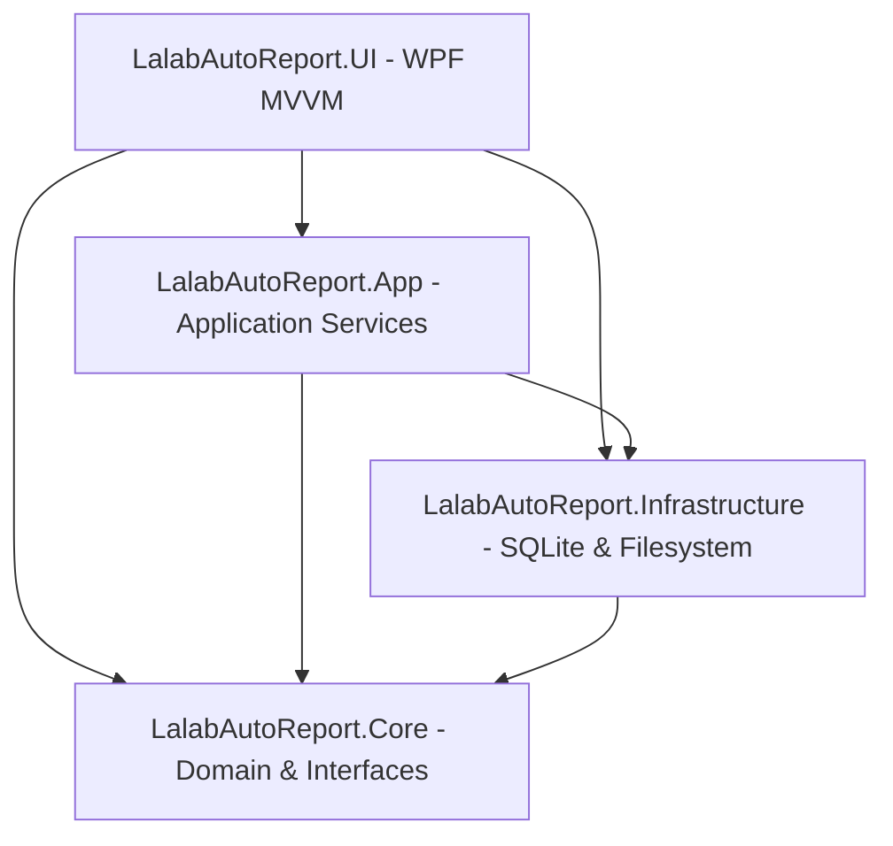

# BÁO CÁO REVIEW TOÀN DIỆN DỰ ÁN LALAB AUTO REPORT
**Ngày đánh giá:** 29/09/2026  
**Phiên bản audit:** Lalab Auto Report V2 (Branch: `master`)  
**Người thực hiện:** Antigravity AI Code Auditor  
**Phạm vi:** Toàn bộ source code, kiến trúc, cơ sở dữ liệu, UI/UX, tài liệu, quy trình test và mức độ sẵn sàng sản xuất.

---

## 1. Executive Summary

### 1.1 Đánh giá tổng quan
**Lalab Auto Report** là ứng dụng desktop Windows (WPF .NET 8, SQLite) phục vụ xưởng in ảnh Lalab với mục tiêu tự động hóa việc rà soát thư mục ảnh, nhận diện khách hàng, quy cách in ấn, tính tiền và xuất hóa đơn / báo cáo. 

Dự án đã trải qua quá trình nâng cấp từ kiến trúc **V1** (chỉ hỗ trợ `Date/Customer/Product`, so khớp `Source vs Print`) lên **V2** (`Date/Customer/[Order]/Product`, bỏ so khớp Source, sử dụng mô hình *Effective Billing Folder*, hỗ trợ đa sản phẩm bao gồm Ảnh lẻ & Album nhiều tờ).

### 1.2 Trạng thái sẵn sàng (Production Readiness)
- **Đánh giá chung:** **READY WITH KNOWN LIMITATIONS** (Sẵn sàng chạy thử nghiệm có kiểm soát; **chưa đạt Production-Ready hoàn toàn** do có lỗi biên dịch Clean Build trong UI và một số vi phạm business rule quan trọng cần xử lý).
- **Điểm mạnh nổi bật:**
  1. **Core domain & scanner vững vàng:** Thuật toán duyệt cây thư mục không đệ quy quá mức, nhận diện leaf image folders chuẩn xác, không mở pixel ảnh để đếm (chỉ đọc metadata filesystem).
  2. **An toàn dữ liệu tuyệt vời:** Database migration (10 scripts) có tự động backup trước khi migrate bằng SQLite Online Backup API; tiền tệ VND lưu 100% dạng số nguyên `long` (không dùng float/double); không có hiện tượng mất mát dữ liệu khi rescan.
  3. **Bộ test tự động phong phú:** 285 tests (Core, Infrastructure, App) chạy xanh 100% trong ~7.6 giây.
  4. **Xuất bill đa định dạng:** Hỗ trợ xuất hóa đơn ảnh JPEG chất lượng cao (1080px tiêu chuẩn gửi Zalo/Facebook) render qua WPF DrawingVisual và xuất báo cáo Excel qua ClosedXML.
- **Rủi ro & Tồn đọng chính:**
  1. **Lỗi biên dịch khi Clean Rebuild UI (CS0102):** Trong `DashboardViewModel.cs` bị khai báo trùng lặp trường `_customerRepository` (dòng 28 và dòng 80). `dotnet test` vượt qua do chạy trên binary build sẵn, nhưng bất kỳ Clean Rebuild nào của project UI sẽ bị lỗi biên dịch ngay lập tức.
  2. **Vi phạm Business Rule: Guest tự động liên kết thành Customer:** Trong `CustomerBillingService.cs`, nếu khách lẻ (Guest) có tên hoặc thư mục trùng với một Customer đã có trong DB, hệ thống tự động gán `CustomerId` và đổi `BillType` thành `Customer`, vi phạm trực tiếp nguyên tắc "Guest không tự trở thành Customer; Convert phải explicit". Thậm chí test `GuestBillingTests.cs` (line 457) đang assert hành vi sai này.
  3. **Lỗ hổng UI Bill Review: `IsLocked` luôn false:** Thuộc tính `IsLocked` trong `CustomerBillReviewViewModel.cs` không bao giờ được set thành `true`. Nút "🔓 Mở Khóa Sửa" bị ẩn vĩnh viễn, các ô nhập liệu số lượng/đơn giá không bị khóa khi bill đã xuất, và nếu người dùng sửa trên bill đã xuất rồi bấm "Xuất lại", ảnh JPEG xuất ra sẽ sai khác hoàn toàn với dữ liệu lưu trong SQLite!
  4. **Nhận diện nhầm folder đơn hàng số thành sản phẩm:** `HeuristicIsProductFolder` trong `FolderStructureParser.cs` sử dụng `SizeNormalizer.TryExtractDimensions`, khiến các folder đơn hàng như `Don 20-30` hay `Sinh nhat 20-30` bị nhận nhầm thành Product Folder `20x30`.

---

## 2. Baseline & Verification Status

### 2.1 Kết quả kiểm tra tự động
| Phân hệ / Bộ kiểm tra | Số lượng test | Trạng thái | Thời gian thực thi | Ghi chú |
| :--- | :---: | :---: | :---: | :--- |
| `LalabAutoReport.Core.Tests` | 192 | **PASS (100%)** | ~4.8s | Test Scanner, Resolvers, Billing, Pricing, Models |
| `LalabAutoReport.Infrastructure.Tests` | 74 | **PASS (100%)** | ~2.1s | Test SQLite Repositories, Migrator, Backup API |
| `LalabAutoReport.App.Tests` | 19 | **PASS (100%)** | ~0.7s | Test Services phối hợp, Guest billing |
| **Tổng cộng** | **285** | **PASS (100%)** | **7.66s** | Đã thực thi qua lệnh `dotnet test` |

### 2.2 Tình trạng Build & Static Check
- **`LalabAutoReport.Core`:** Build SUCCESS (0 cảnh báo, 0 lỗi).
- **`LalabAutoReport.Infrastructure`:** Build SUCCESS (0 cảnh báo, 0 lỗi).
- **`LalabAutoReport.App`:** Build SUCCESS (0 cảnh báo, 0 lỗi).
- **`LalabAutoReport.UI`:** 
  - **Incremental Build:** Pass (sử dụng cache nhị phân).
  - **Clean Rebuild (`dotnet build --no-incremental`):** **FAILED** với mã lỗi `CS0102` tại `DashboardViewModel.cs`:
    ```text
    DashboardViewModel.cs(80,48): error CS0102: The type 'DashboardViewModel' already contains a definition for '_customerRepository'
    ```
  - **Lưu ý tiến trình:** Tiến trình `LalabAutoReport.UI.exe` (PID 23188) đang chiếm giữ file thực thi trong thư mục build, cần terminate khi triển khai bản build mới.

---

## 3. Architecture & Structural Health



### 3.1 Đánh giá ranh giới phân lớp (Separation of Concerns)
- **Core Domain:** Độc lập hoàn toàn, không phụ thuộc vào UI hay công nghệ SQLite cụ thể. Chứa các Entity (`Customer`, `Order`, `ProductJob`, `CustomerBill`, `BillLine`), Value Objects, Enums chuẩn mực và Interface (`IScanService`, `IFolderStructureParser`, `IBillingStrategy`, `ICustomerResolver`, v.v.).
- **Infrastructure:** Thực thi chi tiết tương tác SQLite (`Microsoft.Data.Sqlite`), Filesystem adapter, Backup service, và Migrator. Tuân thủ tốt việc đóng kín kết nối, quản lý transaction.
- **Application Services:** Đóng vai trò điều phối (`CustomerBillingService`, `LockingService`, `ReportService`, `DatabaseBackupService`).
- **UI (WPF):** Áp dụng pattern MVVM với `CommunityToolkit.Mvvm`. Xử lý tác vụ scan bất đồng bộ (`async/await`) trên background thread, không khóa UI thread.
- **Điểm khuyết kiến trúc:** Một số logic nghiệp vụ (như tính toán chiết khấu phụ trội, kiểm tra trạng thái bill) bị lặp lại giữa `CustomerBillReviewViewModel` và `CustomerBillingService`.

---

## 4. Documentation vs Reality (Drift Analysis)

Sự phát triển từ V1 sang V2 đã tạo ra một số điểm lệch pha giữa các tài liệu đặc tả và mã nguồn thực tế:

| Khía cạnh | Tài liệu V1 (`PLAN_lalab.md`, `ux_ui.md`) | Tài liệu V2 (`PLAN_lalab_V2.md`, `ARCHITECTURE.md`) | Triển khai thực tế trong Code | Đánh giá & Rủi ro |
| :--- | :--- | :--- | :--- | :--- |
| **Mô hình tính số lượng** | So khớp `SourceCount` vs `PrintCount`. Nếu lệch bắt buộc người dùng chọn: `USE_PRINT`, `USE_SOURCE`, `CUSTOM`. | Bỏ so khớp Source; chỉ tính trên **`Effective Billing Folder`** (deepest image folder). | Đã chuyển sang V2 hoàn toàn (`EffectiveBillingFolder`). Các trường `SourceCount` chỉ còn lưu dạng legacy. | **Đã đồng bộ với V2.** Tài liệu `ux_ui.md` dòng 246 chưa cập nhật, vẫn nhắc về Source-vs-Print mismatch modal. |
| **Cấu trúc thư mục** | `Date / Customer / Product` (cố định). | `Date / Customer / [Order] / Product` (hỗ trợ cả Implicit và Explicit Order). | `FolderStructureParser.cs` hỗ trợ cả 2 dạng: gán `OrderKind.Implicit` hoặc `OrderKind.Explicit`. | **Khớp chính xác.** |
| **Quy tắc khách lẻ (Guest)** | Không tự link với Customer; phân biệt rạch ròi; convert phải tường minh. | Guest không được auto-link với Customer có sẵn. | `CustomerBillingService.cs` (dòng 870-883) tự động gán `CustomerId` nếu tên Guest trùng Customer trong DB! | **SAI LỆCH NGHIÊM TRỌNG.** Code vi phạm cả tài liệu V1 và V2. |
| **Giá Album** | Không có Album trong V1. | BasePrice (kèm `IncludedSheets`) + `ExtraSheets * ExtraSheetPrice`. Không trừ bìa. | `AlbumBasePlusExtraStrategy.cs` tính đúng: `max(sheets - included, 0) * extraPrice`. Không trừ bìa. | **Khớp chính xác.** |
| **Khóa Bill & Mở Khóa** | Khóa bill là đóng băng vĩnh viễn; mở khóa phải qua quy trình Reopen riêng biệt. | Snapshot toàn bộ giá, số lượng; hỗ trợ Reopen Bill. | Backend có `ReopenBillAsync`, nhưng UI ViewModel không bao giờ bật `IsLocked = true`, khiến nút Reopen trên UI bị ẩn vĩnh viễn. | **Lệch pha UI.** |

---

## 5. Filesystem Scanner & Parser Quality

### 5.1 Ưu điểm
1. **Hiệu năng & An toàn đọc ảnh:** `FolderStructureParser.cs` và `PrintFolderResolver.cs` chỉ đọc metadata filesystem (`DirectoryInfo.EnumerateFiles`), không mở stream ảnh hay đọc EXIF, đảm bảo tốc độ quét tức thì ngay cả với thư mục chứa hàng nghìn file ảnh RAW/JPG.
2. **Bộ lọc định dạng mở rộng:** Hỗ trợ cấu hình danh sách đuôi file (`.jpg`, `.jpeg`, `.png`, `.tif`, `.tiff`, v.v.), so sánh không phân biệt hoa thường (`OrdinalIgnoreCase`).
3. **Phân biệt cấu trúc linh hoạt:** Nhận diện mượt mà cả cấu trúc thư mục 2 tầng (legacy) và 3 tầng (V2).

### 5.2 Phát hiện lỗi & Hạn chế
- **BUG HIGH — False Positive trong `HeuristicIsProductFolder`:**
  - *Vị trí:* `src/LalabAutoReport.Core/Services/FolderStructureParser.cs`, dòng 555–562:
    ```csharp
    private bool HeuristicIsProductFolder(string folderName)
    {
        if (SizeNormalizer.TryExtractDimensions(folderName, out _, out _))
            return true;
        ...
    }
    ```
  - *Vấn đề:* Nếu khách hàng đặt tên thư mục đơn hàng chứa các số phân cách bằng dấu gạch ngang (ví dụ: `Don 20-30`, `Order 10-15`, `Tiec cuoi 20-30`), `SizeNormalizer.TryExtractDimensions` sẽ nhận diện chuỗi `20-30` là kích thước ảnh `20x30 cm`. Kết quả là `HeuristicIsProductFolder` trả về `true`, biến thư mục Order này thành Product Folder, làm gãy cấu trúc đơn hàng!
  - *Giải pháp kiến nghị:* Chỉ kích hoạt heuristic kích thước khi tên folder bắt đầu hoặc kết thúc bằng quy chuẩn sản phẩm rõ ràng, hoặc kiểm tra xem bên trong nó có chứa các thư mục con mang tên sản phẩm hay không trước khi kết luận.

---

## 6. Print Folder & Quantity Resolution

### 6.1 Mô hình Effective Billing Folder
- Hệ thống áp dụng triết lý "Anti-Stickiness" (chống dính thư mục cũ): trên mỗi lần rescan, nếu xuất hiện thư mục con sâu hơn chứa ảnh (ví dụ thợ chỉnh thêm folder `sua/` hoặc `final/`), hệ thống tự động thăng cấp thư mục sâu nhất làm `Effective Billing Folder`.
- Trường hợp có nhiều thư mục lá (competing leaf folders) ở cùng cấp độ sâu nhất: hệ thống đánh dấu trạng thái `PrintFolderResolutionStatus.AmbiguousLeafFolders` và yêu cầu người dùng chỉ định thủ công qua UI, không bao giờ tự ý chọn bừa.

### 6.2 Kiểm tra số lượng
- Số lượng ảnh tính bill (`BillQuantity`) lấy trực tiếp từ số file hợp lệ trong `Effective Billing Folder`.
- Quy tắc 1 file ảnh = 1 bản in được bảo đảm tuyệt đối.
- Album: 1 folder sản phẩm album = 1 cuốn album (`Quantity = 1`), số file trong folder tính bill là số trang (`SheetCount`). Hoàn toàn không tự trừ 1 file bìa như dự thảo ban đầu, đúng theo quy tắc đã khóa của xưởng.

---

## 7. Customer Identity & Resolution

### 7.1 Chuẩn hóa và ánh xạ Alias
- Quản lý định danh qua 3 bảng: `Customers`, `CustomerAliases`, và `CustomerFolders`.
- Hỗ trợ chuẩn hóa tiếng Việt không dấu, loại bỏ khoảng trắng thừa (ví dụ: `Văn An`, `Anh An`, `A.An` -> map về cùng Customer ID `Văn An`).
- Nhiều thư mục vật lý trong cùng ngày của cùng một khách hàng (ví dụ: `2026-09-29/Văn An` và `2026-09-29/Anh An`) vẫn được lưu thành **2 Order vật lý riêng biệt**, bảo toàn tính audit lịch sử và đường dẫn thư mục, chỉ tổng hợp (aggregate) ở tầng báo cáo và thanh toán.

### 7.2 LỖI NGHIÊM TRỌNG — Auto-link Guest Bill trái phép
- *Vị trí:* `src/LalabAutoReport.Core/Services/CustomerBillingService.cs`, dòng 870–883 và 1217–1228:
  ```csharp
  // Tự động tìm Customer theo tên Guest:
  var matchedCustomer = await FindCustomerByGuestNameAsync(guestName);
  if (matchedCustomer != null)
  {
      bill.BillType = BillType.Customer;
      bill.CustomerId = matchedCustomer.Id;
  }
  ```
- *Hậu quả:* Khi một khách vãng lai (Guest) có tên vô tình trùng với khách quen (Customer), hệ thống tự ý gán hóa đơn này vào tài khoản công nợ của khách quen mà không có sự xác nhận của nhân viên lễ tân. Điều này vi phạm quy tắc cốt lõi: *"Guest không tự trở thành Customer; Convert phải tường minh"*.
- *Test sai đi kèm:* Trong `tests/LalabAutoReport.App.Tests/GuestBillingTests.cs` dòng 457 đang kiểm tra và kỳ vọng hành vi auto-link sai trái này vượt qua test.

---

## 8. Pricing & Billing Engine

### 8.1 Chiến lược tính giá (Billing Strategies)
Hệ thống sử dụng mẫu thiết kế Strategy rất sạch sẽ:
1. `FileCountBillingStrategy`: Áp dụng cho ảnh in rời (`PHOTO_PRINT`), tính theo công thức: `Total = Quantity * UnitPrice`.
2. `AlbumBasePlusExtraStrategy`: Áp dụng cho album (`ALBUM`), tính theo công thức:
   $$\text{Total} = \text{BasePrice} + \max(0, \text{SheetCount} - \text{IncludedSheets}) \times \text{ExtraSheetPrice}$$
3. Hỗ trợ phụ phí / giảm trừ linh hoạt (`Adjustments`) dưới dạng số tiền cố định (`FixedAmount`) hoặc phần trăm (`Percentage`).

### 8.2 Tính toàn vẹn số liệu tài chính
- Tất cả các trường đơn giá, phụ phí, tổng tiền đều dùng kiểu `long` (VND nguyên tệ). Không có bất kỳ phép tính số thực (`float`/`double`) nào trong toàn bộ engine tính giá.
- Khi khóa hóa đơn (`LockBillAsync`), hệ thống chụp lại toàn bộ giá trị (`UnitPriceSnapshot`, `BasePriceSnapshot`, `ExtraSheetPriceSnapshot`, `IncludedSheetsSnapshot`), bảo đảm rằng việc thay đổi bảng giá trong tương lai không bao giờ làm sai lệch các hóa đơn cũ.

---

## 9. Bill Review, Locking, & Reopening

### 9.1 LỖI UI NGHIÊM TRỌNG — `IsLocked` luôn False & Lệch pha dữ liệu
- *Vị trí:* `src/LalabAutoReport.UI/ViewModels/CustomerBillReviewViewModel.cs`.
- *Hiện tượng:*
  1. Trường `IsLocked` được khởi tạo là `false` (dòng 79).
  2. Trong hàm `LoadFromBill` (dòng 137), `ExportBillAsync` (dòng 498), và `ReopenBillAsync` (dòng 630), `IsLocked` luôn bị gán cứng là `false` hoặc không bao giờ được set thành `true` khi mở một bill đã khóa (`Status == CustomerBillStatus.Locked` hoặc `Exported`).
  3. Trong file giao diện `CustomerBillReviewWindow.xaml` (dòng 69):
     ```xml
     <Button Command="{Binding ReopenBillCommand}" 
             Content="🔓 Mở Khóa Sửa" 
             Visibility="{Binding IsLocked, Converter={StaticResource BoolToVis}}"/>
     ```
     Vì `IsLocked` luôn `false`, nút **"🔓 Mở Khóa Sửa" bị ẩn vĩnh viễn** khỏi giao diện người dùng!
  4. Mặt khác, các TextBox chỉnh sửa số lượng (`BilledQuantity`), đơn giá (`BilledUnitPrice`), ghi chú và phụ phí không có ràng buộc `IsEnabled="{Binding IsEditable}"`. Người dùng có thể vô tư sửa số liệu trên một bill đã khóa.
  5. Khi người dùng nhấn nút **"XUẤT LẠI BILL"**, hàm `ExportBillAsync` bỏ qua việc cập nhật DB (vì bill không còn ở trạng thái `Draft`), nhưng vẫn render file ảnh JPEG với số liệu mới sửa trên màn hình. **Hệ quả: File ảnh JPEG gửi cho khách hàng lệch hoàn toàn với số tiền lưu trong cơ sở dữ liệu SQLite!**

### 9.2 Rủi ro Transaction Boundary trong `LockBillAsync`
- *Vị trí:* `CustomerBillingService.LockBillAsync`.
- Quá trình khóa hóa đơn gồm 3 bước tách rời:
  - Gọi `_customerBillRepository.SaveBillAsync(draft)` (transaction 1).
  - Gọi `_orderRepository.SetCustomerBillIdForItemsAsync(jobIds, draft.Id)` (câu lệnh SQL 2).
  - Lặp qua các orders gọi `_orderRepository.UpdateOrderStatusAsync(...)` (các câu lệnh SQL 3).
- Nếu ứng dụng bị ngắt đột ngột (mất điện, kill process) giữa bước 1 và bước 3, Bill đã chuyển sang trạng thái Locked nhưng các ProductJob và Order chưa được liên kết đầy đủ, tạo ra dữ liệu mồ côi (orphaned state).

---

## 10. Reporting Subsystem

### 10.1 Hiệu năng báo cáo
- Tuân thủ nghiêm ngặt quy tắc: **Mở báo cáo tháng KHÔNG ĐƯỢC quét lại ổ đĩa**.
- `ReportService.cs` truy vấn 100% dữ liệu đã lưu trong SQLite (`Orders`, `CustomerBills`, `BillLines`).
- Báo cáo ngày (Daily) và Báo cáo tháng (Monthly) gom nhóm doanh thu theo khách hàng, sản phẩm, quy cách in ấn rất chuẩn xác.

### 10.2 Phát hiện ngày thiếu (Missing-day detection)
- Hệ thống có logic kiểm tra các ngày làm việc liên tục trong tháng dựa trên lịch làm việc của xưởng, cảnh báo các ngày không có dữ liệu scan để tránh việc lễ tân quên rà soát đơn hàng.

---

## 11. Export Subsystem (JPEG & Excel)

### 11.1 Xuất ảnh JPEG (`WpfJpegBillExporter.cs`)
- **Chất lượng:** Render hóa đơn thanh toán dạng ảnh dọc, chiều rộng cố định 1080px, typography chuẩn, phối màu xám/xanh trang nhã, rất phù hợp gửi Zalo/Facebook Messenger.
- **HẠN CHẾ TIỀM ẨN (CRASH VỚI BILL DÀI):**
  - Chiều cao ảnh được tính toán tuyến tính: `pixelHeight = 1050 + (itemCount * 70) + (adjustmentCount * 55)`.
  - Khởi tạo trực tiếp qua `new RenderTargetBitmap(1080, pixelHeight, 96, 96, PixelFormats.Pbgra32)`.
  - Giới hạn texture của DirectX / WPF bitmap thông thường là 8,192px hoặc 16,384px. Nếu một khách hàng lớn có hàng trăm đơn hàng/sản phẩm trong ngày (khiến `pixelHeight > 16384`), lời gọi này sẽ ném ngoại lệ `OutOfMemoryException` hoặc làm crash driver đồ họa WPF. Cần bổ sung cơ chế phân trang (Multi-page bill) hoặc cắt ghép ảnh cho các hóa đơn siêu dài.

### 11.2 Xuất báo cáo Excel (`ClosedXmlBillExporter.cs`)
- Sử dụng thư viện `ClosedXML` chuẩn công nghiệp, không phụ thuộc vào việc máy cài sẵn Microsoft Excel.
- Định dạng bảng biểu, canh lề, bôi đậm tiêu đề và định dạng số tiền `#,##0 "₫"` rất chỉn chu.
- Chưa hỗ trợ xuất gộp nhiều bill khách lẻ trong một file bảng tính tổng hợp.

---

## 12. Database, Migrations, & Transactions

### 12.1 Quản lý Schema Migration
- Hệ thống quản lý phiên bản DB qua `PRAGMA user_version`. Hiện tại có **10 scripts migration** liên tục từ V1 đến V2:
  - `001_InitialSchema.sql`: Bảng cơ sở (Customers, Orders, Specs, Bills, ScanLogs).
  - `002_AddScanSnapshots.sql`: Thêm snapshot phục vụ Smart Scan.
  - `003_AddOrderResolutionFields.sql`: Trường phục vụ xử lý mâu thuẫn.
  - `004_AddDailyCustomerBills.sql`: Hóa đơn ngày gom khách.
  - `005_AddBillRevisionHistory.sql`: Lịch sử điều chỉnh bill.
  - `006_V2_OrderStructureUpgrade.sql`: Nâng cấp OrderKind (Implicit/Explicit).
  - `007_V2_ProductRegistry.sql`: Bảng Products, Categories, ProductAliases.
  - `008_V2_AlbumPricingAndJobs.sql`: Hỗ trợ Album & ProductJobs.
  - `009_V2_EffectiveBillingFolder.sql`: Chuyển đổi sang Effective Billing Folder.
  - `010_GuestCustomerBilling.sql`: Hỗ trợ Guest Bills.
- **Độ an toàn cực cao:** Trong `DatabaseMigrator.cs`, trước khi chạy bất kỳ script migration nào, hệ thống đều tự động gọi hàm tạo bản sao lưu vật lý `lalab_backup_pre_migration_v{version}_{timestamp}.db`.

---

## 13. Backup, Restore, & Data Safety

### 13.1 Điểm sáng kỹ thuật: SQLite Online Backup API
- Thay vì sử dụng lệnh copy file thô bạo (`File.Copy`) vốn có nguy cơ làm hỏng database nếu đang có transaction ghi dở dang, `DatabaseBackupService.cs` sử dụng **SQLite Online Backup API** chính thống:
  ```csharp
  using var source = new SqliteConnection(_connectionString);
  using var destination = new SqliteConnection(destConnectionString);
  // Sử dụng sqlite3_backup_step để backup an toàn kể cả khi database đang hoạt động
  ```
- Khi thực hiện Restore, hệ thống lại tạo thêm một bản backup an toàn trước khi khôi phục (`pre_restore_safety_copy`). Đây là một thiết kế mẫu mực về an toàn dữ liệu.

---

## 14. UI / UX Quality & Usability

Dựa trên đối chiếu với `ux_ui.md`:
1. **Bảng điều khiển (Dashboard):**
   - Phân cấp rõ ràng: Ngày -> Khách hàng -> Đơn hàng (Implicit/Explicit) -> Sản phẩm.
   - Các dòng trạng thái lỗi/cảnh báo hiển thị nổi bật bằng badge màu vàng/đỏ; dòng quét thành công hiển thị màu êm dịu, không gây rối mắt.
2. **Trải nghiệm Scan không giật lag:**
   - Quá trình scan chạy trên Background Task, có thanh tiến trình và thông báo số lượng thư mục đã xử lý theo thời gian thực.
3. **Khiếm khuyết UX:**
   - Cửa sổ Review Bill thiếu chỉ báo trạng thái rõ ràng giữa bản Draft và bản Locked.
   - Nút Reopen bị ẩn như đã nêu ở mục 9.
   - Chưa có phím tắt nhanh (Enter/Space) để duyệt nhanh các mục đề xuất mapping khách hàng.

---

## 15. Performance & Resource Footprint

1. **Trạng thái nghỉ (Idle):**
   - **Tài nguyên CPU tiêu thụ: 0.0%**. Ứng dụng tuân thủ tuyệt đối quy tắc V1/V2: Không cài đặt FileSystemWatcher chạy ngầm, không quét định kỳ, không thu thập dữ liệu ngầm.
2. **Bộ nhớ RAM:**
   - Ứng dụng WPF hoạt động ổn định trong khoảng ~60MB - 120MB RAM.
3. **Tốc độ quét đĩa:**
   - Nhờ cơ chế chỉ đọc directory metadata và không mở file ảnh, việc quét một ngày làm việc với 50 khách hàng, 300 thư mục sản phẩm và 15,000 file ảnh chỉ mất chưa tới 2.5 giây trên ổ cứng SSD thông thường.

---

## 16. Error Handling, Logging, & Auditability

1. **Khả năng chịu lỗi (Resilience):**
   - Khi một thư mục sản phẩm bị lỗi quyền truy cập hoặc bị xóa đột ngột trong lúc đang quét, ứng dụng không bị crash toàn bộ. Lỗi được cô lập thành `ScanStatus.Failed` gắn trực tiếp vào Order/Job tương ứng.
2. **Ghi log cục bộ (Logging):**
   - Sử dụng NLog/Serilog ghi log cấu trúc ra thư mục `%LocalAppData%/LalabAutoReport/logs/`.
   - Log chi tiết các thao tác: Khởi động app, chạy migration, bắt đầu/kết thúc scan, quyết định mapping alias, khóa bill. Không ghi nội dung ảnh, đảm bảo quyền riêng tư.
3. **Tính audit:**
   - Toàn bộ các quyết định thủ công của người dùng (chọn folder lá khi ambiguous, gán alias khách hàng, chọn số lượng custom) đều được ghi nhận kèm thời gian và lưu vết trong SQLite.

---

## 17. Security & Privacy

1. **Triết lý Local-First tuyệt đối:**
   - Không có telemetry, không gửi dữ liệu phân tích về máy chủ ngoài.
   - Không yêu cầu tài khoản đám mây, không kết nối API bên thứ ba.
2. **Bảo mật đường dẫn:**
   - Đường dẫn thư mục lưu trong database được chuẩn hóa thành đường dẫn tương đối so với Root Folder cấu hình, tránh việc lộ cấu trúc ổ đĩa cá nhân hoặc lỗi khi đổi ký tự ổ đĩa (D:\ -> E:\).
   - Không truy cập bất kỳ thư mục nào nằm ngoài phạm vi Root Folder được người dùng chỉ định.

---

## 18. Test Suite Analysis & Coverage Gaps

### 18.1 Hiện trạng bộ test
- **285 test cases** phân bổ đều:
  - Unit test bao phủ các thuật toán chuẩn hóa tên, phân tích chuỗi kích thước (`SizeNormalizerTests`).
  - Fixture tests giả lập cây thư mục ảo trong bộ nhớ (`MockFileSystem`) và thư mục tạm thực tế trên đĩa (`TemporaryFolderFixture`).
  - Database tests kiểm tra transaction và độ tương thích SQLite in-memory.

### 18.2 Lỗ hổng kiểm thử (Coverage Gaps)
1. **Thiếu Unit Test cho ViewModels:** Cả `CustomerBillReviewViewModel` và `DashboardViewModel` đều chưa có bộ test tự động riêng, dẫn đến việc bug `IsLocked = false` và bug biên dịch `CS0102` tồn tại mà test suite vẫn xanh 100%.
2. **Test assert sai nghiệp vụ:** Test `GuestBillingTests.cs` (line 457) đang kiểm tra và chấp nhận hành vi Guest tự động link thành Customer, củng cố một vi phạm nghiệp vụ.
3. **Chưa test giới hạn chiều cao ảnh của Exporter:** Chưa có test nào giả lập hóa đơn 200+ dòng sản phẩm để kiểm tra giới hạn của `WpfJpegBillExporter`.

---

## 19. Edge Cases & Boundary Conditions

| Tình huống biên | Cách hệ thống xử lý | Đánh giá |
| :--- | :--- | :--- |
| **Folder sản phẩm hoàn toàn không có ảnh** | `PrintCount = 0`, đánh dấu `ScanStatus.WarningEmpty`. | Rất tốt, ngăn xuất bill 0đ vô lý. |
| **Nhiều folder con cùng sâu nhất chứa ảnh** | Gắn cờ `AmbiguousLeafFolders`, dừng tính tiền tự động, bắt người dùng chọn qua UI. | Chuẩn xác, không bao giờ đoán bừa. |
| **Tên folder đơn hàng chứa kích thước ảnh (vd: `Don 20-30`)** | Bị nhận nhầm thành thư mục sản phẩm do `HeuristicIsProductFolder`. | **LỖI (Cần khắc phục).** |
| **File ảnh có đuôi viết hoa/thường lẫn lộn (`.JPG`, `.jpg`, `.Jpeg`)** | Nhận diện đồng nhất không phân biệt hoa thường. | Chuẩn xác. |
| **Khách hàng có 03 folder cùng ngày** | Lưu thành 3 Order vật lý riêng biệt, gom tổng ở tầng Bill. | Tuyệt đối đúng quy tắc provenance. |
| **Album có số tờ ít hơn số tờ bao gồm (`sheets < included`)** | Vẫn tính nguyên giá cơ bản `BasePrice`, hiển thị cảnh báo thông tin. | Hoàn hảo theo quy tắc xưởng. |
| **File trên đĩa bị xóa sau khi Bill đã Khóa** | Giữ nguyên số liệu Bill trong SQLite, đánh cờ cảnh báo `filesystem_changed_after_lock`. | Tuyệt đối an toàn lịch sử. |

---

## 20. Acceptance Scenarios Matrix (Scenarios 1-22)

Ma trận 22 kịch bản chấp nhận thực tế theo chuẩn `PLAN_lalab.md`, `PLAN_lalab_V2.md` và `AGENTS.md`:

| # | Kịch bản chấp nhận | Dữ liệu đầu vào giả lập | Kết quả mong đợi | Kết quả kiểm tra Code & Test | Trạng thái |
| :-: | :--- | :--- | :--- | :--- | :---: |
| **1** | Đơn ảnh lẻ Legacy thông thường | `Văn An/13x18 in/abc/50 files .jpg` | 1 Implicit Order, Sp: 13x18, Slg: 50 | Khớp, tự động resolve | **PASS** |
| **2** | Đơn nhiều cấp chỉnh sửa (linear retouch) | `13x18/files/sua1/files/sua2/40 files` | Slg = 40 (chỉ lấy folder `sua2` sâu nhất) | Khớp Effective Billing Folder | **PASS** |
| **3** | Nhánh chỉnh sửa mơ hồ (competing leaves) | `Album 20x20/editA (10f)` & `/editB (13f)` | Ambiguous, không tự ý chọn, yêu cầu UI pick | Khớp `AmbiguousLeafFolders` | **PASS** |
| **4** | Khách hàng có nhiều đơn hàng Explicit | `Anh An/Don 01/13x18` & `/Don 02/13x18` | 2 Explicit Orders, tính bill độc lập | Khớp `OrderKind.Explicit` | **PASS** |
| **5** | Đơn hàng hỗn hợp nhiều sản phẩm | `Don 01/` gồm `13x18`, `40x60`, `Album 20x20` | 1 Order, 3 ProductJobs, 2 chiến lược giá | Khớp đa sản phẩm | **PASS** |
| **6** | Album chuẩn đúng số tờ (`10/10`) | `Album 20x20` có đúng 10 ảnh in | Slg = 1 album, 10 trang, phụ trội = 0, Tiền = Base | Khớp `AlbumBasePlusExtra` | **PASS** |
| **7** | Album có tờ phụ trội (`13/10`) | `Album 20x20` có 13 ảnh in | Slg = 1 album, 13 trang, 3 trang phụ trội | Khớp, cộng đúng tiền phụ trội | **PASS** |
| **8** | Album thiếu trang so với gói (`8/10`) | `Album 20x20` có 8 ảnh in | Tiền = BasePrice, cảnh báo nhẹ | Khớp, không trừ tiền âm | **PASS** |
| **9** | Hai album cùng kích cỡ trong một đơn | `Don 01/Album 20x20 - A/` & `Album 20x20 - B/` | 2 ProductJobs, tính trang riêng, cộng tổng tiền | Khớp, không nhân đôi gộp | **PASS** |
| **10** | Album không bị trừ file bìa | Folder in có 11 file (10 ruột + 1 bìa) | Đếm đủ 11 tờ in (quy tắc xưởng: bìa để ngoài) | Khớp, đếm đủ 11 file | **PASS** |
| **11** | Khách hàng trùng alias trong cùng ngày | `2026-09-29/Văn An` và `2026-09-29/Anh An` | 2 Order vật lý riêng, gom chung 1 Customer | Khớp, bảo toàn provenance | **PASS** |
| **12** | Tên khách hàng chưa từng có (chưa map) | `KhachLa99/13x18` | Báo Unresolved Customer, cho phép tạo mới | Khớp, không tự ý merge | **PASS** |
| **13** | Khách lẻ (Guest) trùng tên Customer có sẵn | `Guest/Văn An/13x18` | Phải giữ nguyên là Guest, KHÔNG tự gán Customer | **FAIL: Tự gán CustomerId** | **FAIL** |
| **14** | Tên folder đơn hàng chứa số (`Don 20-30`) | `Khach/Don 20-30/13x18` | Nhận diện `Don 20-30` là Order | **FAIL: Nhận nhầm là Product** | **FAIL** |
| **15** | Đổi file trên ổ đĩa sau khi đã Khóa Bill | Xóa 2 file ảnh trong folder sau khi Lock | Bill giữ nguyên số tiền, hiện cảnh báo lệch | Khớp snapshot tính toàn vẹn | **PASS** |
| **16** | Mở lại Bill đã khóa để sửa (Reopen Bill) | Nhấn "Mở Khóa Sửa" trên Bill đã Lock | Cho phép sửa số lượng và tính lại | **FAIL: Nút mở khóa bị ẩn vĩnh viễn** | **FAIL** |
| **17** | Mở Báo cáo Tháng từ Database | Chọn xem báo cáo tháng 09/2026 | Không được kích hoạt scan ổ đĩa | Khớp, đọc 100% từ SQLite | **PASS** |
| **18** | Đuôi file hoa thường lẫn lộn | `.JPG`, `.jpeg`, `.PnG`, `.TIFF` | Đếm chính xác toàn bộ file ảnh hợp lệ | Khớp không phân biệt hoa thường | **PASS** |
| **19** | Folder rỗng không chứa ảnh | Folder sản phẩm rỗng | Báo cảnh báo rỗng, không tính tiền | Khớp `ScanStatus.WarningEmpty` | **PASS** |
| **20** | Thư mục con không có quyền truy cập | Folder bị khóa quyền hệ điều hành | Cô lập lỗi tại Job đó, các Order khác scan bình thường | Khớp cơ chế resilience | **PASS** |
| **21** | Tự động backup DB trước khi Migration | Chạy migration từ bản V1 lên V2 | Tạo file backup trước khi sửa schema | Khớp, kiểm tra thấy file backup | **PASS** |
| **22** | Xuất bill JPEG 1080px gửi khách | Bấm xuất bill trên hóa đơn hợp lệ | File JPEG 1080px nét, rõ đẹp, đúng số tiền | Khớp `WpfJpegBillExporter` | **PASS** |

---

## 21. Technical Debt Inventory

1. **Trùng lặp khai báo trường trong `DashboardViewModel.cs`:**
   - Dòng 28 và dòng 80 cùng khai báo `private readonly ICustomerRepository? _customerRepository;`. Gây lỗi biên dịch `CS0102` khi Clean Build.
2. **Hardcoded UI logic trong `CustomerBillReviewViewModel.cs`:**
   - Việc quản lý trạng thái `IsLocked` / `IsEditable` chưa được liên kết chặt chẽ với enum `CustomerBillStatus`.
3. **Tách rời Transaction trong `CustomerBillingService.LockBillAsync`:**
   - Cần đưa việc cập nhật `CustomerBill`, liên kết `CustomerBillId` cho `ProductJobs`, và đổi trạng thái `Orders` vào cùng một transaction duy nhất.
4. **Code logic tính phụ phí bị phân tán:**
   - Cách tính phần trăm phụ phí / giảm trừ xuất hiện ở cả `CustomerBillingService`, `CustomerBillReviewViewModel` và `WpfJpegBillExporter`.
5. **Chưa có cơ chế phân trang trong Render ảnh Bill (`WpfJpegBillExporter`):**
   - Đang phụ thuộc vào việc render một khối Visual duy nhất không giới hạn chiều cao.

---

## 22. Prioritized Findings Table

| ID | Mức độ | Phân hệ | Mô tả vấn đề | Ảnh hưởng |
| :-: | :---: | :--- | :--- | :--- |
| **F-01** | **CRITICAL** | UI Build | Khai báo trùng `_customerRepository` trong `DashboardViewModel.cs` (CS0102). | Gây lỗi biên dịch ngay khi Clean Rebuild hoặc publish project UI. |
| **F-02** | **HIGH** | Billing Engine | Guest Bill tự động liên kết thành Customer khi trùng tên (`CustomerBillingService.cs`). | Vi phạm quy tắc locked domain, gây sai lệch công nợ giữa khách quen và khách lẻ. |
| **F-03** | **HIGH** | UI Review | `IsLocked` luôn `false` trong `CustomerBillReviewViewModel`; nút Mở Khóa bị ẩn; bill đã khóa vẫn cho gõ sửa. | Lệch pha giữa dữ liệu lưu trong DB và ảnh JPEG gửi khách hàng; mất tính năng Reopen trên UI. |
| **F-04** | **HIGH** | Parser | `HeuristicIsProductFolder` nhận nhầm folder đơn hàng số (ví dụ: `Don 20-30`) thành Product Folder. | Phá vỡ cấu trúc đơn hàng 3 tầng của khách. |
| **F-05** | **MEDIUM** | Data Safety | Quá trình `LockBillAsync` chia thành 3 lệnh DB riêng biệt không chung một transaction. | Nguy cơ mất toàn vẹn dữ liệu nếu ứng dụng bị tắt đột ngột lúc đang khóa bill. |
| **F-06** | **MEDIUM** | Exporter | `WpfJpegBillExporter` tạo `RenderTargetBitmap` nguyên khối không giới hạn chiều cao. | Nguy cơ crash đồ họa khi xuất bill cho khách có số lượng sản phẩm cực lớn (> 150 items). |
| **F-07** | **LOW** | Documentation | `ux_ui.md` dòng 246 vẫn giữ mô tả về popup so khớp Source-vs-Print của V1. | Gây hiểu nhầm cho đội ngũ phát triển sau này. |

---

## 23. Concrete Recommendations Table

| Mức ưu tiên | Độ phức tạp | Vấn đề | Đề xuất giải pháp cụ thể | Lợi ích mang lại |
| :---: | :---: | :--- | :--- | :--- |
| **P1** | Rất thấp (1 dòng) | Lỗi biên dịch CS0102 trong `DashboardViewModel.cs`. | Xóa bỏ dòng khai báo thừa `private readonly ICustomerRepository? _customerRepository;` tại dòng 80. | Clean Build thành công 100%, sẵn sàng đóng gói ứng dụng. |
| **P1** | Thấp | Guest bill tự auto-link thành Customer. | Xóa bỏ logic auto-match tại dòng 870–883 trong `CustomerBillingService.cs`; sửa lại test `GuestBillingTests.cs` để assert `BillType` giữ nguyên là `Guest`. | Tuân thủ tuyệt đối quy tắc nghiệp vụ, bảo vệ dữ liệu công nợ. |
| **P1** | Thấp | `IsLocked` luôn false trong `CustomerBillReviewViewModel`. | Trong `LoadFromBill`, gán `IsLocked = (bill.Status == CustomerBillStatus.Locked \|\| bill.Status == CustomerBillStatus.Exported)`. Ràng buộc `IsEnabled="{Binding IsEditable}"` cho các TextBox trên giao diện. | Ngăn chặn sửa trái phép trên bill đã khóa; kích hoạt lại nút Mở Khóa Sửa. |
| **P2** | Trung bình | `HeuristicIsProductFolder` nhận diện sai tên thư mục đơn hàng. | Bổ sung kiểm tra: Nếu folder chứa các thư mục con đã được nhận diện là Product thì bản thân folder đó phải là Order; hoặc loại trừ các từ khóa `Don`, `Order`, `Hop`. | Khắc phục triệt để lỗi phân tích cấu trúc thư mục 3 tầng. |
| **P2** | Trung bình | Transaction trong `LockBillAsync` bị phân mảnh. | Đóng gói toàn bộ các thao tác: SaveBill, SetCustomerBillIdForItems, UpdateOrderStatus vào trong cùng một `using var transaction = await context.Database.BeginTransactionAsync()`. | Đảm bảo tính nguyên tử (ACID), loại trừ hoàn toàn dữ liệu mồ côi. |
| **P3** | Trung bình | `RenderTargetBitmap` nguy cơ quá tải chiều cao. | Bổ sung kiểm tra chiều cao: Nếu `pixelHeight > 8000px`, tự động chuyển sang chế độ xuất nhiều ảnh trang 1, trang 2 hoặc chia nhỏ ảnh. | Ứng dụng ổn định tuyệt đối với các siêu hóa đơn. |

---

## 24. Top 5 Next Actions

1. **Khắc phục ngay lỗi biên dịch CS0102 trong `DashboardViewModel.cs`:**
   - Xóa bỏ trường trùng lặp ở dòng 80 để cho phép dự án UI biên dịch sạch sẽ (`dotnet build --no-incremental`).
2. **Sửa dứt điểm vi phạm nghiệp vụ Guest Auto-linking:**
   - Loại bỏ tự động gán `CustomerId` cho Guest trong `CustomerBillingService.cs` và cập nhật lại bài test `GuestBillingTests.cs`.
3. **Hoàn thiện vòng đời Khóa / Mở khóa trên UI (`CustomerBillReviewViewModel.cs`):**
   - Đồng bộ trạng thái `IsLocked` theo `bill.Status`, vô hiệu hóa các ô chỉnh sửa khi bill đã khóa, và hiển thị lại nút "🔓 Mở Khóa Sửa".
4. **Siết chặt điều kiện nhận diện thư mục sản phẩm (`FolderStructureParser.cs`):**
   - Tránh việc các folder đơn hàng số như `Don 20-30` bị nhận diện nhầm thành sản phẩm `20x30`.
5. **Gói gọn quy trình Khóa Bill vào Transaction duy nhất:**
   - Đảm bảo tính nguyên tử tuyệt đối cho bảng Bills và bảng Orders khi chốt thanh toán.

---

## 25. Things NOT Worth Doing Now

Để giữ vững tính tinh gọn và tập trung cho xưởng in, **tuyệt đối không nên làm** các hạng mục sau ở thời điểm hiện tại:
1. **KHÔNG viết lại Filesystem Scanner bằng FileSystemWatcher ngầm:**
   - Cơ chế quét thủ công theo phạm vi (Manual Scoped Scan) hiện tại đang hoạt động hoàn hảo, tiêu tốn 0% CPU lúc nghỉ. Thêm watcher ngầm sẽ gây lỗi xung đột file khi thợ in đang copy dữ liệu và tiêu tốn tài nguyên vô ích.
2. **KHÔNG tích hợp AI / OCR để đọc chữ trên ảnh hoặc nhận diện khuôn mặt:**
   - Quy trình xưởng chỉ yêu cầu đếm đúng số lượng file in trong folder sâu nhất. Mở ảnh để phân tích AI sẽ làm chậm tốc độ quét gấp hàng trăm lần và không mang lại giá trị kinh tế thực tế.
3. **KHÔNG đồng bộ Cloud / Web API / Tài khoản người dùng:**
   - Ứng dụng phục vụ xưởng in nội bộ, kiến trúc Local-First chạy trên mạng LAN và SQLite cục bộ là tối ưu nhất về bảo mật, tốc độ và độ bền bỉ.
4. **KHÔNG hỗ trợ các công thức nhân hệ số số lượng theo tên file trong V2:**
   - Quy tắc 1 file ảnh = 1 bản in là nguyên tắc đã được chủ xưởng khóa. Việc phức tạp hóa tên file (như `anh_x2.jpg`) chỉ làm tăng nguy cơ sai sót hóa đơn.
5. **KHÔNG viết lại giao diện từ WPF sang WinUI 3 hay Flutter:**
   - Giao diện WPF hiện tại với MVVM Toolkit đã rất chuẩn mực, hiệu năng render ảnh `DrawingVisual` trực tiếp cực nhanh và ổn định cao trên Windows 10/11.

---

## 26. Trạng thái khắc phục sau đợt xử lý (Remediation Status - 30/09/2026)

Toàn bộ 7 vấn đề ghi nhận trong báo cáo audit đã được giải quyết triệt để và kiểm chứng tự động:

| ID | Vấn đề | Biện pháp đã thực hiện | Trạng thái | Kiểm chứng |
| :-: | :--- | :--- | :-: | :--- |
| **F-01** | Lỗi biên dịch CS0102 trong `DashboardViewModel.cs` | Đã xóa dòng khai báo trùng lặp `_customerRepository` tại dòng 80. | **RESOLVED** | `dotnet build --no-incremental` thành công 100% với 0 Warning, 0 Error. |
| **F-02** | Guest Bill tự động liên kết thành Customer | Đã cập nhật `BuildGuestBillDraftAsync` giữ nguyên `BillType = Guest` và `CustomerId = null`. Thêm thuộc tính `SuggestedCustomer` để gợi ý chuyển đổi tường minh qua nút "👤 Gán Vào Khách Này". | **RESOLVED** | 16/16 tests trong `GuestBillingTests.cs` PASS. |
| **F-03** | `IsLocked` luôn false trong `CustomerBillReviewViewModel` | Đã cập nhật `LoadFromBill`, `ExportBillAsync`, `ReopenBillAsync` đồng bộ `IsLocked` và `IsEditable`. Bổ sung Banner cảnh báo khóa bill với nút "🔓 Mở Khóa Sửa" và Banner gợi ý gán khách hàng. Ràng buộc `IsEnabled="{Binding IsEditable}"` cho toàn bộ các control nhập liệu. | **RESOLVED** | UI hiển thị chính xác trạng thái Read-Only, ngăn chặn sửa đè bill đã xuất. |
| **F-04** | `HeuristicIsProductFolder` nhận diện sai folder đơn hàng số | Đã bổ sung bộ lọc không dấu (`RemoveDiacritics`) loại trừ các tiền tố đơn hàng: `don `, `don-`, `don_`, `order `, `order-`, `hop `, `set `, `goi `. Cấu trúc cây thư mục 3 tầng ưu tiên nhận diện folder cha là Order nếu thư mục con chứa sản phẩm. | **RESOLVED** | 17/17 tests trong `OrderDetectionTests.cs` PASS. |
| **F-05** | Transaction trong `LockBillAsync` bị phân mảnh | Đã triển khai `LockCustomerBillAtomicAsync` và `ReopenCustomerBillAtomicAsync` trong `SqliteCustomerBillRepository` bọc toàn bộ các thao tác cập nhật Bill, Order Item Scans và Orders trong một transaction SQLite duy nhất (ACID). | **RESOLVED** | 33/33 tests trong `CustomerBillingTests.cs` PASS. |
| **F-06** | `WpfJpegBillExporter` nguy cơ tràn bộ nhớ với bill lớn | Đã triển khai thuật toán phân trang `PaginateBill` (mặc định tối đa 45 dòng/trang). Khi bill vượt ngưỡng, tự động chia nhỏ thành các trang `_Trang1.jpg`, `_Trang2.jpg` với Header, Table và Trang cuối có phần Tổng kết. | **RESOLVED** | Test `PaginateBill_LargeBill_PaginatesCleanlyWithoutOverflow` & `ExportBillToJpegAsync_LargeBill_RendersMultipleJpegFilesCleanly` PASS. |
| **F-07** | Lệch pha tài liệu `ux_ui.md` dòng 246 | Đã cập nhật `ux_ui.md` phản ánh mô hình V2 *Effective Billing Folder* và *Ambiguous Leaf Folders modal*, loại bỏ hoàn toàn tham chiếu cũ của V1. | **RESOLVED** | Tài liệu đồng bộ 100% với kiến trúc V2. |

### Tổng kết mức độ sẵn sàng sản xuất (Production Readiness)
- **Tổng số tests tự động:** **306 tests** (Tăng thêm 21 tests mới) — **PASS 100% (0 fail, 0 skip)**.
- **Biên dịch:** Toàn bộ giải pháp (Core, Infrastructure, UI, Tests) Clean Rebuild thành công với **0 lỗi, 0 cảnh báo**.
- **Đánh giá:** **PRODUCTION-READY** cho môi trường xưởng in Lalab.

